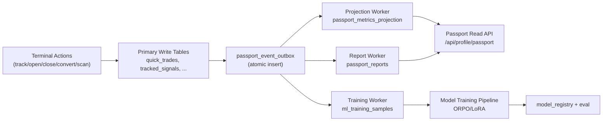

# Passport Backend Architecture v1 (2026-02-25)

> 학습 파이프라인 상세(Pretraining/SFT/ORPO/Retraining)는 `PASSPORT_ML_ORPO_LEARNING_ARCHITECTURE_v2_2026-02-25.md`를 기준으로 한다.

## 1) 목적

이 문서는 STOCKCLAW 기준으로 `Terminal -> 저장 -> 집계/분석 -> Passport 표시 -> AI 학습 확장`을 하나의 백엔드 흐름으로 고정하기 위한 설계안이다.

핵심 목표:

1. 트레이딩 이벤트를 누락 없이 기록한다.
2. Passport 지표(승률/방향정확도/IDS/캘리브레이션 등)를 즉시 갱신 가능하게 만든다.
3. 사용자별 강점/약점/개선점 분석 글을 저장하고 재조회 가능하게 만든다.
4. 누적 데이터를 AI 트레이딩 전용 학습 데이터로 안전하게 확장한다.

## 2) 설계 기준 (근거 문서)

- `/Users/ej/Downloads/stockclaw-unified.backup-20260224-055018/docs/STOCKCLAW_FlowSpec_v2_0.md`
  - F-TERM-002/003/004/005: Track/Quick Trade/Copy Trade/Convert 저장 플로우
  - F-PASS-002/007: Passport 메트릭 계산식 + 트리거 시점
- `/Users/ej/Desktop/항목을 포함하는 새로운 폴더/젠베리파이/Stockclaw/STOCKCLAW_PassportUX_v1_20260220 (1).html`
  - 트리거 표 + "이벤트 즉시 트랜잭션, 실패 시 재시도 큐" 원칙
- `/Users/ej/Desktop/항목을 포함하는 새로운 폴더/젠베리파이/Stockclaw/STOCKCLAW_PassportUX_v1_20260220.docx`
  - `passport_records` 확장 스키마, 온체인 동기화 지연 처리
- `/Users/ej/Downloads/항목을 포함하는 새로운 폴더 9/STOCKCLAW_WHITEPAPER_EN_v1_20260218.md`
  - 의사결정 해시/검증 실적/모델 학습 플라이휠 방향
- `/Users/ej/Downloads/stockclaw_whitepaper_v2_STCLAW_updated.docx`
  - ORPO/LoRA 주기학습을 위한 outcome-labeled 데이터 축적 요구

## 3) 현재 코드 기준 As-Is

현재 저장 경로:

- Terminal Scan: `terminal_scan_runs`, `terminal_scan_signals` (scanService)
- Signal 추적: `tracked_signals` (`/api/signals/track`)
- Quick Trade: `quick_trades` (`/api/quick-trades/open`, `/api/quick-trades/{id}/close`)
- Copy Trade 액션: `copy_trade_runs`, `signal_actions`
- PnL ledger: `pnl_entries`
- Passport 조회: `/api/profile/passport` (요약 집계)

현재 문제:

1. Passport용 "분석 리포트" 저장소가 없다.
2. 이벤트별 집계 파이프라인이 약해 지표 계산이 엔드포인트별로 분산된다.
3. AI 학습용 데이터셋(특징, 라벨, 모델 버전, 평가)이 구조화되어 있지 않다.
4. 테이블/컬럼 네이밍이 마이그레이션 버전에 따라 혼재(`entry` vs `entry_price`, `users` vs `app_users`)되어 정규화가 필요하다.

## 4) Target 아키텍처 (우리 기준)



핵심 결정:

1. **Primary write + outbox 동시 트랜잭션**을 표준으로 한다.
2. Passport 화면은 원본 테이블 직접 조합이 아니라 **projection 테이블**에서 읽는다.
3. 분석 글은 `passport_reports`에 버전 저장한다(재생성 가능).
4. 학습 데이터는 `ml_training_samples`로 별도 적재한다(PII 분리).

## 5) 데이터 모델 (신규/확장)

## 5.1 이벤트 원장

```sql
CREATE TABLE passport_event_outbox (
  event_id uuid PRIMARY KEY DEFAULT gen_random_uuid(),
  user_id uuid NOT NULL,
  event_type text NOT NULL,
  event_time timestamptz NOT NULL DEFAULT now(),
  source_table text NOT NULL,
  source_id text NOT NULL,
  idempotency_key text NOT NULL,
  payload jsonb NOT NULL,
  status text NOT NULL DEFAULT 'pending', -- pending|processing|done|failed
  retry_count int NOT NULL DEFAULT 0,
  next_retry_at timestamptz,
  last_error text,
  created_at timestamptz NOT NULL DEFAULT now(),
  UNIQUE (idempotency_key)
);
```

- 원칙: quick-trade open/close, signal track/convert, copy-trade publish, arena result, prediction settle 시점에 outbox를 반드시 같이 쓴다.

## 5.2 Passport 집계 테이블 (L1 핵심)

```sql
CREATE TABLE passport_records_v2 (
  user_id uuid PRIMARY KEY,
  total_hypotheses int NOT NULL DEFAULT 0,
  total_approved int NOT NULL DEFAULT 0,
  total_rejected int NOT NULL DEFAULT 0,
  win_count int NOT NULL DEFAULT 0,
  loss_count int NOT NULL DEFAULT 0,
  total_pnl_bps bigint NOT NULL DEFAULT 0,
  best_pnl_bps int NOT NULL DEFAULT 0,
  worst_pnl_bps int NOT NULL DEFAULT 0,
  current_streak int NOT NULL DEFAULT 0,
  max_consecutive_win int NOT NULL DEFAULT 0,
  max_consecutive_loss int NOT NULL DEFAULT 0,
  direction_correct int NOT NULL DEFAULT 0,
  direction_total int NOT NULL DEFAULT 0,
  dissent_count int NOT NULL DEFAULT 0,
  dissent_win_count int NOT NULL DEFAULT 0,
  override_offered int NOT NULL DEFAULT 0,
  override_accepted int NOT NULL DEFAULT 0,
  override_ignored int NOT NULL DEFAULT 0,
  override_ignored_loss int NOT NULL DEFAULT 0,
  confidence_sum int NOT NULL DEFAULT 0,
  confidence_samples int NOT NULL DEFAULT 0,
  coin_accuracy jsonb NOT NULL DEFAULT '{}',
  updated_at timestamptz NOT NULL DEFAULT now()
);
```

- `coin_accuracy`는 동시성 경합을 줄이기 위해 최종적으로 분리 권장:
  - `passport_coin_stats(user_id, coin, total, correct, pnl_bps_sum, updated_at)`

## 5.3 파생 지표 스냅샷 (조회 가속)

```sql
CREATE TABLE passport_metric_snapshots (
  snapshot_id uuid PRIMARY KEY DEFAULT gen_random_uuid(),
  user_id uuid NOT NULL,
  computed_at timestamptz NOT NULL DEFAULT now(),
  win_rate numeric(6,2) NOT NULL,
  direction_accuracy numeric(6,2) NOT NULL,
  ids_score numeric(6,2),
  calibration_score numeric(6,2),
  guardian_adherence numeric(6,2),
  challenge_win_rate numeric(6,2),
  avg_pnl_bps numeric(12,2),
  risk_adjusted_score numeric(12,4),
  sample_sizes jsonb NOT NULL,
  UNIQUE (user_id, computed_at)
);
CREATE INDEX idx_passport_metric_snapshots_user_time
  ON passport_metric_snapshots(user_id, computed_at DESC);
```

## 5.4 분석 결과 글 저장

```sql
CREATE TABLE passport_reports (
  report_id uuid PRIMARY KEY DEFAULT gen_random_uuid(),
  user_id uuid NOT NULL,
  report_type text NOT NULL,             -- daily|weekly|monthly|on_demand
  period_start timestamptz NOT NULL,
  period_end timestamptz NOT NULL,
  model_name text NOT NULL,
  model_version text NOT NULL,
  input_snapshot jsonb NOT NULL,
  strengths jsonb NOT NULL DEFAULT '[]', -- [{title, evidence, impact}]
  weaknesses jsonb NOT NULL DEFAULT '[]',
  improvements jsonb NOT NULL DEFAULT '[]',
  ai_training_impact jsonb NOT NULL DEFAULT '{}',
  summary_md text NOT NULL,
  score_overview jsonb NOT NULL DEFAULT '{}',
  status text NOT NULL DEFAULT 'final',  -- draft|final|archived
  created_at timestamptz NOT NULL DEFAULT now(),
  UNIQUE (user_id, report_type, period_start, period_end)
);
CREATE INDEX idx_passport_reports_user_created
  ON passport_reports(user_id, created_at DESC);
```

- 요구사항의 "결과글 저장해서 보여주기"는 `summary_md` + 구조화 필드로 충족한다.

## 5.5 AI 학습 샘플 저장

```sql
CREATE TABLE ml_training_samples (
  sample_id uuid PRIMARY KEY DEFAULT gen_random_uuid(),
  user_id uuid NOT NULL,
  source_event_id uuid NOT NULL,
  asset text NOT NULL,
  timeframe text,
  strategy_tags text[] NOT NULL DEFAULT '{}',
  feature_vector jsonb NOT NULL,
  decision jsonb NOT NULL,      -- direction/entry/tp/sl/confidence
  outcome jsonb NOT NULL,       -- pnl_bps, hold_sec, win, drawdown, etc
  label_quality text NOT NULL,  -- good|bad|neutral
  model_feedback jsonb NOT NULL DEFAULT '{}',
  created_at timestamptz NOT NULL DEFAULT now(),
  UNIQUE (source_event_id)
);
CREATE INDEX idx_ml_training_samples_user_time
  ON ml_training_samples(user_id, created_at DESC);
```

추가:

- `model_registry(model_id, model_name, version, train_window, eval_metrics, deployed_at, status)`
- `model_eval_runs(eval_id, model_id, dataset_version, metrics, created_at)`

## 6) API 설계

## 6.1 Write path (기존 API 유지 + outbox 추가)

기존 엔드포인트는 유지한다.

- `/api/signals/track`
- `/api/signals/{id}/convert`
- `/api/quick-trades/open`
- `/api/quick-trades/{id}/close`
- `/api/copy-trades/publish`
- `/api/arena/*` 결과 확정 엔드포인트

각 handler 내부 규칙:

1. primary table write
2. `passport_event_outbox` insert
3. 둘 다 성공 시 commit

## 6.2 Read path (Passport)

기존 `/api/profile/passport` 확장:

```json
{
  "success": true,
  "passport": {
    "tier": "diamond",
    "totalMatches": 147,
    "wins": 98,
    "losses": 49,
    "winRate": 66.67,
    "directionAccuracy": 72.14,
    "ids": 61.2,
    "calibration": -4.2,
    "guardianAdherence": 78.0,
    "challengeWinRate": 65.0,
    "openTrades": 3,
    "trackedSignals": 5,
    "latestReportId": "..."
  }
}
```

신규 엔드포인트:

- `GET /api/profile/passport/reports?type=weekly&limit=12`
- `GET /api/profile/passport/reports/{reportId}`
- `POST /api/profile/passport/reports/generate` (on-demand)
- `GET /api/profile/passport/training-impact` (학습 기여도 요약)

## 6.3 Terminal 조회 연동

- scan/history는 현재 구조 유지
- Passport positions 탭은 `/api/positions/unified` 유지
- 추가 조회: 특정 trade가 어떤 리포트/학습샘플에 반영됐는지 연결
  - `GET /api/quick-trades/{id}/lineage`

## 7) 집계/리포트 워커 규칙

## 7.1 Projection Worker

- 입력: `passport_event_outbox (pending)`
- 처리: event_type별 `passport_records_v2` upsert
- 성공: status=done
- 실패: retry_count++, exponential backoff, status=failed(임계 초과)

idempotency:

- `idempotency_key` unique로 중복처리 방지
- worker는 event_id 기반 exactly-once 보장 대신 **at-least-once + dedup** 모델 사용

## 7.2 Report Worker

트리거 조건 (둘 중 하나):

1. closed trade 5건 누적
2. 일/주 스케줄(예: KST 09:00)

생성 절차:

1. 최신 snapshot + 최근 trade/actions/scan/hypothesis 로드
2. 강점/약점/개선점/학습효과 초안 생성
3. `passport_reports` 저장 (버전 포함)
4. Passport 알림 생성 (`user_notifications`)

## 7.3 Training Worker

- closed trade + pre-trade context + post outcome를 샘플화
- feature leakage 체크(미래값 제거)
- `ml_training_samples` 저장
- 주간 학습 파이프라인에 배치 export

## 8) AI 학습 확장 전략 (왜 성능이 좋아지는가)

1. **개인화 데이터 축적**
   - 유저별 강점 setup(예: DISSENT 상황, 특정 코인, 특정 시간대)을 분리 학습 가능
2. **결과 라벨 품질 상승**
   - 단순 승패가 아니라 `pnl_bps`, `drawdown`, `hold_time`, `override`까지 포함해 라벨 정보량 증가
3. **실패 패턴 학습**
   - `override_ignored_loss`, 손절 미준수, 과신/과소신뢰 패턴이 모델 피드백 feature로 반영
4. **주기적 개선 루프**
   - 보고서/스냅샷/샘플이 자동 누적되어 주간 재학습 데이터가 자동 업데이트

## 9) 일관성/장애 대응

원칙:

- Passport 핵심 수치 갱신은 "이벤트 직후"를 기준으로 한다.
- 동기 집계 실패가 primary write를 막지 않도록 outbox+worker로 분리한다.

장애 처리:

1. outbox 누적 모니터링 (`pending` 건수, oldest age)
2. failed 이벤트 DLQ 테이블 분리
3. 관리자 재처리 API
4. 온체인 동기화 실패 시 `onchain_tx_latest = null`, 상태는 `pending_onchain`

## 10) 보안/권한

1. 모든 read/write는 `getAuthUserFromCookies` 인증 필수
2. user_id 강제 조건(타인 데이터 조회 금지)
3. 학습 export는 PII 제거(지갑/이메일 제외)
4. 공개 Passport 응답에서 민감 지표(worst pnl, max consecutive loss 등)는 role/관계 기반 마스킹

## 11) 구현 로드맵

Phase A (1주):

1. `passport_event_outbox`, `passport_records_v2`, `passport_reports` 마이그레이션
2. quick-trades/signals/copy-trades 엔드포인트에 outbox insert 추가
3. `/api/profile/passport`를 projection 우선 조회로 변경

Phase B (1~2주):

1. projection/report worker 배포
2. reports 조회/생성 API 구현
3. Passport UI에 보고서 탭 연결

Phase C (2주+):

1. `ml_training_samples` + model registry/eval 테이블 도입
2. 주간 학습 배치 + 안전 평가 게이트
3. 모델 업데이트 노트/성과 비교를 Passport에 노출

## 12) 바로 착수할 작업 항목

1. 스키마 정규화 결정 (`users/app_users`, `entry/entry_price`, `dir/direction`)을 먼저 확정
2. outbox 이벤트 타입 표준 정의
3. `/api/quick-trades/{id}/close` 기준으로 첫 projection 이벤트부터 붙이기
4. `passport_reports` 최소 버전(weekly summary) 먼저 출시

---

이 설계의 결론:

- Terminal의 모든 행동이 Passport와 AI 학습으로 누락 없이 이어진다.
- 결과 글은 재생성 가능한 버전 데이터로 저장되고, 사용자에게 즉시 보여줄 수 있다.
- 장기적으로는 사용량이 곧 모델 성능 개선 데이터가 되는 구조가 된다.
