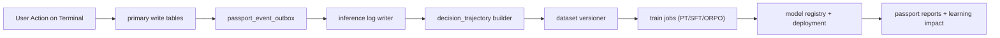

# Passport ML Learning Architecture v2 (Pretraining + Retraining + ORPO)

## 1) 목적

이 문서는 MAXI⚡DOGE Passport를 위한 학습 체계를 `우리 서비스 데이터 구조`에 맞춰 고정한다.
범위는 아래 전체 루프다.

1. Terminal 행동/결과 저장
2. 학습용 데이터셋 생성/버전관리
3. Pretraining (domain adaptation)
4. SFT (행동 모방)
5. ORPO (선호 최적화)
6. 배포/평가/리트레이닝
7. Passport에서 결과와 개선점을 사용자에게 재노출

핵심 목표:

- 사용자 행동/성과가 모델 성능 개선으로 실제 환류되도록 한다.
- 방향성 정확도뿐 아니라 리스크 준수, 드로우다운, 일관성까지 학습한다.
- 모델 업그레이드가 실제 지표 개선(승률, bps, MDD)로 검증된 경우에만 배포한다.

## 2) 모델 분리 원칙 (2-Model Topology)

`트레이딩 의사결정 모델`과 `리포트 작성 모델`을 분리한다.

- Policy Model (PM): 매매 방향/진입/청산/리스크 추천
- Analyst Model (AM): 강점/약점/개선안 보고서 생성

분리 이유:

1. PM은 보수적 평가(수익/리스크) 중심, AM은 설명 품질 중심이다.
2. PM 실험과 AM 실험의 배포 속도/리스크가 다르다.
3. 장애 시 PM만 롤백하거나 AM만 교체할 수 있다.

## 3) Terminal 저장/조회 연계 (온라인 원장)

기존 write path(`signals/track`, `quick-trades/open|close`, `signals/{id}/convert`)에 아래 원장을 추가한다.



필수 lineage 키:

- `trace_id`: 한 번의 사용자 의사결정 체인 식별자
- `inference_id`: 특정 모델 추론 결과 식별자
- `source_event_id`: primary write 레코드와 연결
- `dataset_version_id`: 어떤 학습 데이터에서 파생됐는지 추적
- `model_version`: 어떤 모델이 추천/보고서를 생성했는지 추적

## 4) 데이터셋 계층 (Dataset Layers)

### L0. Event Lake (raw)

- 입력: `passport_event_outbox`, `quick_trades`, `tracked_signals`, `pnl_entries`
- 특성: 정규화 전 원본 + 삭제 금지 + 파티셔닝(day/user)

### L1. Decision Trajectory

- 단위: `pre_context -> decision -> action -> outcome`
- 예시 필드:
  - pre_context: 변동성, 펀딩, OI 변화, 시장 레짐, 세션 시간대
  - decision: direction, confidence, tp/sl, leverage, rationale hash
  - outcome: pnl_bps, max_drawdown_bps, hold_sec, slippage_bps

### L2. Pretraining Corpus

- PM/AM 공통 텍스트-구조 데이터
- 도메인 용어/시장 구조/리스크 규칙을 학습시키는 연속 코퍼스

### L3. SFT Samples

- `input -> ideal_output` 포맷
- 고품질 샘플만 포함(top decile risk-adjusted returns + 규칙준수)

### L4. Preference Pairs (ORPO)

- `(prompt, chosen, rejected)` 구조
- 같은 컨텍스트에서 더 나은 행동을 chosen으로 라벨

## 5) 스키마 상세 (신규)

```sql
CREATE TABLE model_inference_logs (
  inference_id uuid PRIMARY KEY DEFAULT gen_random_uuid(),
  user_id uuid NOT NULL,
  trace_id text NOT NULL,
  model_name text NOT NULL,
  model_version text NOT NULL,
  model_role text NOT NULL, -- policy|analyst
  prompt_hash text NOT NULL,
  prompt_payload jsonb NOT NULL,
  response_payload jsonb NOT NULL,
  latency_ms int NOT NULL,
  created_at timestamptz NOT NULL DEFAULT now(),
  UNIQUE (trace_id, model_role, created_at)
);

CREATE TABLE decision_trajectories (
  trajectory_id uuid PRIMARY KEY DEFAULT gen_random_uuid(),
  user_id uuid NOT NULL,
  trace_id text NOT NULL,
  source_event_id uuid NOT NULL,
  inference_id uuid,
  context_features jsonb NOT NULL,
  decision_features jsonb NOT NULL,
  outcome_features jsonb,
  utility_score numeric(12,4),
  label_quality text NOT NULL DEFAULT 'pending', -- pending|good|bad|ambiguous
  created_at timestamptz NOT NULL DEFAULT now(),
  UNIQUE (source_event_id)
);

CREATE TABLE ml_dataset_versions (
  dataset_version_id uuid PRIMARY KEY DEFAULT gen_random_uuid(),
  dataset_type text NOT NULL, -- pretrain|sft|orpo
  window_start timestamptz NOT NULL,
  window_end timestamptz NOT NULL,
  sample_count int NOT NULL,
  filters jsonb NOT NULL,
  quality_report jsonb NOT NULL,
  created_at timestamptz NOT NULL DEFAULT now()
);

CREATE TABLE ml_preference_pairs (
  pair_id uuid PRIMARY KEY DEFAULT gen_random_uuid(),
  dataset_version_id uuid NOT NULL,
  user_id uuid NOT NULL,
  trace_id text NOT NULL,
  prompt jsonb NOT NULL,
  chosen jsonb NOT NULL,
  rejected jsonb NOT NULL,
  margin_score numeric(12,4) NOT NULL,
  pair_quality text NOT NULL, -- high|medium|low
  created_at timestamptz NOT NULL DEFAULT now()
);

CREATE TABLE ml_train_jobs (
  train_job_id uuid PRIMARY KEY DEFAULT gen_random_uuid(),
  train_type text NOT NULL, -- pretrain|sft|orpo|retrain
  model_role text NOT NULL, -- policy|analyst
  base_model text NOT NULL,
  target_model_version text NOT NULL,
  dataset_version_ids uuid[] NOT NULL,
  hyperparams jsonb NOT NULL,
  status text NOT NULL DEFAULT 'queued', -- queued|running|failed|succeeded
  started_at timestamptz,
  finished_at timestamptz,
  artifacts jsonb NOT NULL DEFAULT '{}'
);

CREATE TABLE ml_eval_reports (
  eval_id uuid PRIMARY KEY DEFAULT gen_random_uuid(),
  train_job_id uuid NOT NULL,
  model_version text NOT NULL,
  eval_scope text NOT NULL, -- offline|shadow|canary
  metrics jsonb NOT NULL,
  gate_result text NOT NULL, -- pass|fail
  created_at timestamptz NOT NULL DEFAULT now()
);
```

## 6) Pretraining 설계 (Domain Adaptation)

### 6.1 초기 Pretraining

- Base: 범용 LLM/시계열 모델을 시작점으로 사용
- 목표: 시장 미시구조, 파생상품 용어, 우리 시스템 이벤트 문법 적응
- 데이터 소스:
  - 내부: Terminal 이벤트/리포트 텍스트/전략 태그
  - 외부: 공개 금융 텍스트(라이선스 확인 필수)

### 6.2 Continual Pretraining (주기)

- 주기: 주 1회 또는 drift 발생 시
- 윈도우: 최근 30~90일 + 핵심 과거 데이터 샘플링
- 규칙:
  - 중복 prompt-response 제거
  - 미래 정보 포함 샘플 제거(leakage 방지)
  - 급변장 구간을 의도적으로 oversample(레짐 편향 완화)

## 7) SFT 설계 (행동 모방)

SFT는 `좋은 실전 행동`을 모델이 직접 따라하도록 만든다.

샘플 선별 규칙:

1. `utility_score` 상위 구간 우선
2. risk rule 위반 없음(손절 미설정, 과도 레버리지 제외)
3. 동일 컨텍스트에서 일관된 결과가 반복된 전략 우선

권장 출력 포맷 (정책 모델):

```json
{
  "direction": "long|short|neutral",
  "entry_plan": {"zone": [0,0], "split": 3},
  "risk_plan": {"sl_bps": 120, "max_position_pct": 8},
  "tp_plan": [{"level": 1, "tp_bps": 180, "size_pct": 40}],
  "confidence": 0.71,
  "rationale": "...",
  "invalidators": ["..."]
}
```

## 8) ORPO 설계 (선호 최적화 핵심)

ORPO 데이터는 "같은 컨텍스트에서 어느 행동이 더 나았는가"를 학습한다.

### 8.1 pair 생성 규칙

- 같은/유사 컨텍스트의 후보 행동 2개를 구성
- 아래 종합점수 차이가 임계값 이상이면 pair 확정

`utility_score = w1*pnl_bps - w2*max_drawdown_bps - w3*rule_violations + w4*direction_hit - w5*time_decay_penalty`

권장 초기 가중치:

- `w1=1.0`, `w2=0.7`, `w3=2.0`, `w4=0.5`, `w5=0.2`

### 8.2 ORPO 학습 단위

- 입력: `(prompt, chosen, rejected)`
- 목표:
  - chosen likelihood 증가
  - rejected likelihood 상대 감소
  - 과도한 스타일 붕괴 없이 SFT 성질 유지

### 8.3 pair 품질 게이트

- `margin_score < min_margin` 샘플 제거
- 레이블 충돌(승패 역전) 샘플은 `ambiguous`로 격리
- 소수 레짐 샘플 비중 최소치 보장(예: 15%)

## 9) 리트레이닝 정책 (Retraining)

리트레이닝은 정기 + 이벤트 트리거 병행.

정기 트리거:

- PM: 주 1회
- AM: 주 2회

이벤트 트리거:

1. 14일 이동 윈도우 승률 하락 `> X%`
2. ECE(캘리브레이션) 악화 `> Y`
3. 레짐 전환 감지(변동성/상관구조 급변)

리트레이닝 모드:

- `light`: 최근 데이터만 LoRA update
- `full`: pretraining + SFT + ORPO 전체 재학습

## 10) 평가/배포 게이트 (Fail-Closed)

### 10.1 오프라인 게이트 (필수)

PM 필수 통과:

1. Directional hit rate >= baseline
2. Avg pnl_bps >= baseline
3. Max drawdown <= baseline * (1 + 허용편차)
4. Risk violation rate <= baseline
5. Calibration(ECE) 개선 또는 동등

AM 필수 통과:

1. 사실 일치율(근거 이벤트 링크 기준)
2. 개선안 실행가능성 점수
3. 금지 표현/허위 확신율

### 10.2 온라인 게이트

1. Shadow (실거래 미적용)
2. Canary 5%
3. Canary 20%
4. Full rollout

각 단계 실패 시 즉시 직전 모델로 롤백한다.

## 11) Passport 표시 설계 (사용자 가치 환류)

Passport에 아래 항목을 명시한다.

- "이번 주 학습 반영도": 내 데이터가 학습에 반영된 샘플 수/비중
- "모델 개선 요약": 이전 모델 대비 개선된 포인트
- "내 약점 교정 진척": 과매수 추격, 손절 지연 등 패턴의 개선 추이
- "신뢰 구간": 모델 확신도와 실제 정확도 차이

신규 API:

- `GET /api/profile/passport/learning/status`
- `GET /api/profile/passport/learning/datasets`
- `GET /api/profile/passport/learning/evals`
- `POST /api/profile/passport/learning/reports/generate`

## 12) 워커/잡 오케스트레이션

필수 워커:

1. `trajectory-worker`: outbox -> decision_trajectories
2. `dataset-worker`: trajectories -> dataset_versions / preference_pairs
3. `train-orchestrator`: schedule + trigger 기반 train jobs 생성
4. `eval-worker`: backtest/shadow/canary 평가
5. `deployment-worker`: gate pass 모델만 serving alias 갱신

운영 규칙:

- 모든 worker는 idempotent 처리
- 재시도는 exponential backoff + dead letter queue
- job 상태 전이는 단방향(`queued -> running -> succeeded|failed`)

## 13) 보안/거버넌스

1. PII 분리 저장(지갑/이메일은 학습셋에서 제거)
2. 모델 입력/출력 로그는 hash + 최소 원문만 저장
3. 데이터셋 버전별 재현성 보장(필터/샘플수/해시 저장)
4. 규정 위반 전략(과도 레버리지 유도)은 학습셋에서 강제 제외

## 14) 구현 단계 (실행 순서)

Phase 1 (즉시):

1. `model_inference_logs`, `decision_trajectories`, `ml_dataset_versions` 도입
2. Terminal write path에 `trace_id`, `inference_id` 주입
3. Passport에서 learning-status 조회 API 노출

Phase 2:

1. SFT 데이터셋 생성기 + 품질 리포트 자동화
2. ORPO pair 생성기(utility 기반) 배포
3. 오프라인 평가 파이프라인 구축

Phase 3:

1. 주기 리트레이닝 스케줄 운영
2. shadow/canary 자동 승격
3. Passport 리포트에서 모델 버전별 개선 결과 시각화

---

결론:

- 이 설계는 "터미널 행동 로그"를 "학습 가능한 고품질 preference 데이터"로 바꾸는 전체 경로를 고정한다.
- ORPO는 우리 서비스의 실제 승패/리스크 맥락을 반영하므로, 단순 정답 맞추기보다 실전 성능 개선에 유리하다.
- Passport는 결과 요약 화면이 아니라, 개인 데이터가 모델 향상으로 환류되는 증거를 보여주는 학습 대시보드가 된다.
