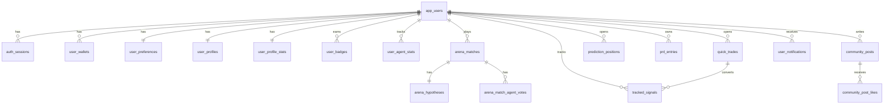

# Database Design (PostgreSQL)

> Note (2026-02-21): This document describes the old `app_users/auth_sessions` naming model.
> For the current runtime-aligned redesign based on page interactions, see:
> - `docs/schema-redesign-analysis.md`
> - `db/migrations/0002_unify_legacy_plus_events.sql`

이 문서는 MAXI-DOGE의 현재 in-memory/localStorage 상태를 서버 DB로 옮기기 위한 기준 스키마입니다.

## 1) Design Goals

- 현재 기능(`auth`, `matches`, `quick trade`, `tracked signal`, `predict`, `profile`)을 손실 없이 수용
- 타입 일관성 강화 (특히 timeframe/direction)
- 읽기 패턴 중심 인덱스 제공 (`user_id + status + created_at`)
- 이후 Supabase/RDS/Neon 등으로 이전 가능한 표준 PostgreSQL DDL 유지

## 2) Canonical Rules

- Timeframe은 DB에서 소문자 canonical 값으로 저장
  - `1m | 5m | 15m | 30m | 1h | 4h | 1d | 1w`
- Pair는 `BASE/QUOTE` 형식 강제 (예: `BTC/USDT`)
- 방향은 enum으로 통일
  - `direction_enum`: `LONG | SHORT | NEUTRAL`
  - `trade_direction_enum`: `LONG | SHORT`

## 3) ER Diagram



## 4) Schema Files

- Canonical migration: `db/migrations/0001_init_postgres.sql`
- Supabase migration mirror: `supabase/migrations/001_init.sql`
  - 두 파일은 동일 스키마를 유지해야 하며, 새 변경은 canonical 파일 기준으로 반영

적용 예시:

```bash
psql "$DATABASE_URL" -f db/migrations/0001_init_postgres.sql
```

## 5) Table Mapping (Current Code -> DB)

- `walletStore` -> `app_users`, `user_wallets`, `auth_sessions`
- `gameState/settings` -> `user_preferences`
- `matchHistoryStore` -> `arena_matches`, `arena_hypotheses`, `arena_match_agent_votes`
- `quickTradeStore` -> `quick_trades`
- `trackedSignalStore` -> `tracked_signals`
- `predictStore.positions` -> `prediction_positions`
- `pnlStore` -> `pnl_entries`
- `communityStore` -> `community_posts`, `community_post_likes`
- `userProfileStore` -> `user_profiles`, `user_profile_stats`, `user_badges`
- `agentData` -> `user_agent_stats`
- `notificationStore` -> `user_notifications`

## 6) API Mapping (Immediate)

- `POST /api/auth/register`
  - insert `app_users`
  - insert `auth_sessions`
- `GET /api/auth/session`
  - lookup `auth_sessions` by token (`revoked_at IS NULL`, `expires_at > now()`)
  - join `app_users`
- `POST /api/auth/wallet`
  - upsert `user_wallets` (`address` unique)
- `GET/POST /api/matches`
  - select/insert `arena_matches` (+ optional `arena_hypotheses`, `arena_match_agent_votes`)

## 7) Rollout Plan

1. **Dual-write 단계**
   - 기존 localStorage/in-memory 유지 + 서버 DB 동시 기록
2. **Read switch 단계**
   - 조회는 DB 우선, 로컬은 fallback
3. **Cleanup 단계**
   - 안정화 후 로컬 persistence 제거 또는 캐시 용도로 축소

## 8) Data Migration Notes

- in-memory 데이터는 서버 재시작 시 유실되므로 과거 데이터 백필은 제한적
- localStorage 데이터는 사용자 로그인 후 `import` API로 업로드하는 방식 권장
- 키 불일치(`agentData` vs `maxidoge_agents`)는 import 전에 정규화 필요

## 9) Open Decisions

- 세션 저장 방식: opaque token vs JWT + revocation table
- wallet 다중 연결 허용 범위 (`is_primary` 정책)
- community post/like를 실시간으로 처리할지 polling으로 처리할지
- 알림 보관 정책 (TTL, 아카이빙)
