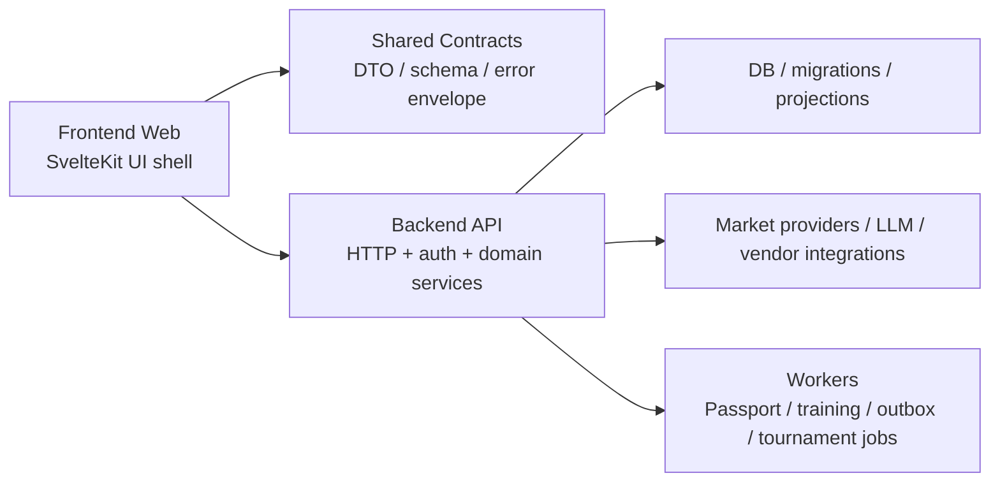

# Frontend / Backend Separation Plan

Date: 2026-03-07  
Status: active design, no code move yet  
Scope: `/Users/ej/Downloads/maxidoge-clones/frontend` as canonical repo, with the sibling `backend` tree treated as an observed reference input

## 1. Decision Summary

We should not start FE/BE separation by blindly moving files between the current `frontend` and `backend` folders.

Current reality:

1. `frontend/` is the canonical implementation target and still contains both UI and server runtime.
2. The sibling `backend` tree is not a clean API service; it is another SvelteKit-shaped full-stack tree with page routes, API routes, `src/lib/api`, and `src/lib/server`.
3. Browser-facing code already tends to call `src/lib/api/**`, which is the best existing seam for extraction.

Therefore the correct design is:

1. first freeze the runtime boundary inside `frontend/`
2. then extract contracts and server-core modules
3. then cut over domain groups from in-app SvelteKit APIs to a dedicated backend API service

This is a separation plan, not a folder-shuffle plan.

## 2. As-Is Diagnosis

## 2.1 Current frontend shape

`frontend/` is a SvelteKit full-stack app with this effective runtime chain:

`browser route/component -> src/lib/api -> src/routes/api/**/+server.ts -> src/lib/server/** -> DB/providers`

This is usable, but it means the current frontend repo still contains:

1. page UI
2. browser state/stores
3. HTTP handlers
4. domain services
5. DB and vendor integrations

## 2.2 Current backend shape

The sibling `backend` tree is not yet the target backend we want.

Observed signals:

1. it still has `src/routes/**/*.svelte`
2. it still has its own `src/lib/api/**`
3. it still mixes UI routes with API/server modules

So separation cannot mean "switch to that folder as-is".

## 2.3 Root problems to solve

1. server authority is embedded inside the frontend runtime
2. contracts are documented, but not yet cleanly extracted into one shared runtime boundary
3. route files and large components still carry too much orchestration
4. any direct extraction now would duplicate drift instead of reducing it

## 3. Target Architecture

## 3.1 Runtime topology

## 3.2 Frontend responsibilities

The frontend should own only:

1. routes, layouts, page composition
2. presentational components
3. client stores and view-model/runtime orchestration
4. browser-side API wrappers
5. transient route/session state
6. optimistic UI staging only

The frontend must not own:

1. DB access
2. secret-bearing provider calls
3. long-term domain authority
4. projection logic that defines canonical user metrics
5. idempotency or settlement rules

## 3.3 Backend responsibilities

The backend should own:

1. auth and session authority
2. profile, badge, progression, passport projections
3. quick-trade, tracked-signal, copy-trade mutation authority
4. market aggregation, scan, chat, LLM, provider orchestration
5. arena match lifecycle, tournament, prediction settlement
6. outbox, retries, background jobs, learning pipelines
7. DB, migrations, rate limits, request guards, abuse protection

## 3.4 Shared boundary

Introduce one explicit shared contract layer for:

1. request DTOs
2. response DTOs
3. error envelope
4. enum/value-domain contracts
5. validation schema

Preferred future home:

1. `packages/contracts`
2. optionally `packages/domain-types` only if contracts become too broad

Until that exists, `src/lib/api/**` is the temporary anti-corruption layer.

## 4. Key Architectural Decisions

## 4.1 Do not repurpose the current `backend` tree blindly

Decision:

1. treat the current sibling `backend` as reference input, not as immediate target runtime
2. salvage server-only modules selectively
3. create a clean API service shell only after contract and server-core extraction are defined

Reason:

If we move to the current `backend` tree now, we keep the same ambiguity with two full-stack apps instead of separating responsibilities.

## 4.2 Extract by domain boundary, not by folder copy

Migration unit must be:

1. one domain
2. one contract set
3. one API group
4. one data authority

Examples:

1. `auth/session`
2. `profile/preferences`
3. `quick-trades`
4. `signals/copy-trades/community`
5. `terminal/intel/chat`
6. `market providers`
7. `arena/predictions/tournaments`
8. `passport learning/outbox/workers`

## 4.3 Standardize contracts before extraction

Before any cutover:

1. normalize success/error envelope
2. freeze enum/value contracts
3. move route-local validation into shared request schema
4. ensure frontend calls domain wrappers, not ad-hoc fetch strings inside components

## 4.4 Keep frontend as the only live app until cutover

During migration:

1. `frontend/` remains the only canonical shipping app
2. extraction happens behind compatible contracts
3. backend cutover is domain-by-domain
4. frontend route code should not change deploy topology until each domain is proven

This avoids running two competing live implementations.

## 5. Target Boundary Rules

## 5.1 Allowed imports in frontend

Frontend code may import:

1. `src/components/**`
2. `src/lib/stores/**`
3. `src/lib/services/**`
4. `src/lib/api/**`
5. `src/lib/utils/**`
6. shared contract packages

Frontend code must not import:

1. `src/lib/server/**`
2. DB clients
3. provider SDKs requiring secrets
4. backend settlement/projection logic

## 5.2 Allowed imports in backend

Backend code may import:

1. shared contract packages
2. domain services
3. persistence/repository modules
4. providers and vendor SDKs
5. queue/outbox/worker modules

Backend code must not import:

1. Svelte UI components
2. browser-only stores
3. route presentation helpers
4. client analytics/pixel code

## 5.3 Route/component rule

UI components and route shells must not build API URLs inline once a domain wrapper exists.

Required shape:

`route/component -> lib/api wrapper -> shared contract -> backend API`

## 6. Target Backend Service Shape

The extracted backend service should be API-only.

Suggested module groups:

1. `auth`
2. `profile`
3. `trading`
4. `signals`
5. `community`
6. `market`
7. `terminal`
8. `arena`
9. `passport`
10. `jobs`
11. `providers`
12. `platform` for db, session, rate-limit, validation, logging

Suggested HTTP groups:

1. `/api/auth/**`
2. `/api/profile/**`
3. `/api/quick-trades/**`
4. `/api/signals/**`
5. `/api/copy-trades/**`
6. `/api/community/**`
7. `/api/market/**`
8. `/api/terminal/**`
9. `/api/arena/**`
10. `/api/predictions/**`
11. `/api/tournaments/**`
12. `/api/notifications/**`

The extracted backend should not contain:

1. `src/routes/+page.svelte`
2. `src/routes/terminal/+page.svelte`
3. any user-facing page route
4. `src/lib/api/**` browser wrappers

## 7. Auth and Session Design

Preferred direction:

1. backend owns session issuance and validation
2. frontend uses `credentials: include`
3. httpOnly cookies remain the primary auth transport
4. no JWT authority in `localStorage`

Implications:

1. frontend SSR/load functions become consumers, not authorities
2. CORS and cookie domain rules must be designed before external cutover
3. auth/session should be the first hard boundary we prove

## 8. Migration Phases

## Phase 0. Boundary Freeze

Purpose:
- stop deeper coupling before extraction

Steps:

1. treat `src/lib/api/**` as mandatory frontend entry point
2. stop new direct component-level fetch strings when a wrapper exists
3. stop new frontend imports of server modules
4. freeze response envelope drift on priority domains

Exit criteria:

1. every active domain has a known wrapper entry
2. no new coupling is introduced

## Phase 1. Contract Extraction

Purpose:
- create a portable API boundary

Steps:

1. define shared DTOs and schemas
2. unify success/error envelope for priority routes
3. standardize validation and body guards
4. generate one domain inventory: route -> handler -> server module -> store/client consumer

Priority domains:

1. `auth/session`
2. `profile/preferences`
3. `quick-trades`
4. `signals/copy-trades`

Exit criteria:

1. frontend wrappers depend on shared contracts, not ad-hoc shapes
2. backend handlers can be rehosted without changing payload shape

## Phase 2. Server-Core Extraction

Purpose:
- make business logic portable before network cutover

Steps:

1. move logic out of SvelteKit handler bodies into service modules
2. isolate `RequestEvent` and cookie specifics at thin transport boundaries
3. isolate DB and provider repositories from route handlers

Exit criteria:

1. route handlers become transport adapters
2. domain services are framework-light

## Phase 3. Backend API Shell

Purpose:
- stand up a clean API service

Steps:

1. create or repurpose a backend app as API-only
2. remove UI/page routes from the extraction target
3. mount shared contracts and server-core modules
4. add health, auth/session, logging, rate-limit, request-id, tracing baseline

Exit criteria:

1. backend runs without user-facing page routes
2. first domain group is callable externally

## Phase 4. Low-Risk Domain Cutover

Purpose:
- prove the split on simpler authority domains first

Suggested order:

1. `auth/session`
2. `profile/preferences`
3. `notifications`
4. read-only market snapshots where possible

Exit criteria:

1. frontend consumes external backend for these domains
2. old in-app handlers are removed or converted to thin proxies

## Phase 5. Mutation Domain Cutover

Purpose:
- move write authority out of the frontend app

Suggested order:

1. `quick-trades`
2. `signals`
3. `copy-trades`
4. `community posts/reactions`

Exit criteria:

1. idempotency and reconciliation rules are backend-owned
2. client stores become projection/cache layers

## Phase 6. Heavy Domain Cutover

Purpose:
- move expensive and secret-bearing operations

Suggested order:

1. `terminal scan/intel/chat`
2. `market provider fan-in`
3. `arena/predictions/tournaments`
4. `passport reports/training/outbox`

Exit criteria:

1. no secret-bearing provider orchestration remains inside the frontend app
2. background work runs server-side only

## Phase 7. Frontend Server Retirement

Purpose:
- finish the split

Steps:

1. remove migrated `src/routes/api/**/+server.ts` handlers from `frontend/`
2. remove migrated `src/lib/server/**` modules from `frontend/`
3. remove server-only dependencies from frontend where possible
4. keep only UI-shell server needs that truly belong to the web app

Exit criteria:

1. frontend becomes a UI-first web app
2. backend becomes the only domain authority

## 9. Domain Priority Order

Recommended extraction order:

1. `auth/session`
2. `profile/preferences`
3. `notifications`
4. `quick-trades`
5. `signals/copy-trades/community`
6. `market snapshot/provider aggregation`
7. `terminal scan/intel/chat`
8. `arena/predictions/tournaments`
9. `passport projection/reports/learning`

Why this order:

1. it proves auth and contract transport early
2. it moves mutation authority before the heaviest interaction surfaces
3. it delays Arena and Passport until contracts, jobs, and server-core extraction are mature

## 10. Success Metrics

We are actually separated when these become true:

1. frontend no longer depends on server-only runtime modules
2. provider/secret-bearing logic exists only in backend
3. profile/trade/signal authority is backend-only
4. frontend route shells mostly orchestrate view-models and wrappers
5. backend contains no user-facing page routes
6. the remaining `frontend/src/routes/api/**` surface trends to zero or proxy-only

## 11. Immediate Next Design Tasks

Before any large code refactor, do these first:

1. create the domain inventory for every active API group
2. classify the current `backend` tree into salvage / duplicate / discard
3. define the shared contract package layout
4. pick the first cutover slice: `auth/session` or `profile/preferences`
5. lock request guard and response envelope standards on those first slices

## 12. Non-Goals

This plan does not yet:

1. choose a final infra vendor or deployment platform
2. define the worker queue implementation in detail
3. rewrite UI routes
4. move files across repos immediately
5. declare the current sibling `backend` tree production-ready

That work happens only after the boundary and migration order are accepted.
