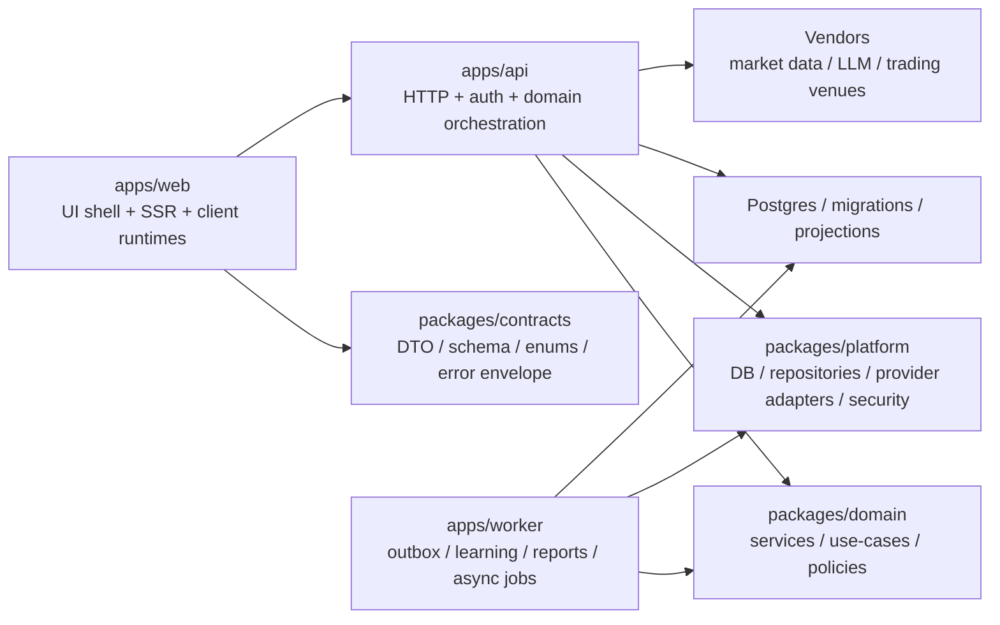

# Full-Stack Redesign Validation

Date: 2026-03-07  
Status: active design authority  
Scope: `/Users/ej/Downloads/maxidoge-clones/frontend` and the sibling `backend` tree as observed inputs

## 1. Executive Verdict

The repo should be redesigned as:

1. one UI-first web app
2. one API-only backend service
3. one worker/job runtime
4. one shared contract layer
5. one shared domain/platform layer

This redesign is valid against the current codebase.

Why:

1. the current `frontend` already contains a usable anti-corruption seam in `src/lib/api/**`
2. the current sibling `backend` is almost a duplicate full-stack tree, not a clean server target
3. the current API surface is already organized enough to extract by domain
4. the main blockers are boundary cleanup and migration order, not missing functionality

What is explicitly rejected:

1. blindly moving files from `frontend` to the current `backend`
2. running two full-stack apps as long-term peers
3. extracting by folder name instead of runtime responsibility

## 2. Current-State Inventory

Snapshot taken from the canonical `frontend` tree:

1. page routes: `11`
2. API handlers: `111`
3. server modules: `69`
4. browser API wrappers: `30`
5. client stores: `22`
6. total `src` code scanned: about `114,827` lines

Largest hotspots:

1. `src/routes/arena/+page.svelte`: `3398`
2. `src/routes/passport/+page.svelte`: `2693`
3. `src/routes/+page.svelte`: `2076`
4. `src/lib/engine/v2BattleEngine.ts`: `1500`
5. `src/components/arena/Lobby.svelte`: `1459`
6. `src/components/arena-v2/BattleScreen.svelte`: `1332`
7. `src/components/arena/ChartPanel.svelte`: `1189`
8. `src/lib/server/intelPolicyRuntime.ts`: `1098`
9. `src/lib/stores/arenaWarStore.ts`: `1080`
10. `src/lib/server/scanEngine.ts`: `962`

## 3. Validated Findings

## 3.1 `frontend` is still a full-stack app

Actual runtime chain today:

`routes/components -> src/lib/api -> src/routes/api/**/+server.ts -> src/lib/server/** -> DB/providers`

This means the current canonical app still owns:

1. UI
2. browser state
3. HTTP transport
4. domain services
5. DB and provider access

## 3.2 The sibling `backend` is not a clean backend target

Validation snapshot:

1. `frontend` API route count: `111`
2. `backend` API route count: `111`
3. route set comparison: identical API sets
4. page route comparison: almost identical page sets
5. only confirmed extra frontend page route today: `/agents`

Verdict:

The sibling `backend` is currently a mirrored app, not the backend we want.

## 3.3 The extraction seam already exists

Positive signal:

Most route/components/stores call browser-side wrappers under `src/lib/api/**`.

Examples:

1. `src/routes/arena/+page.svelte` uses `$lib/api/arenaApi`
2. `src/routes/passport/+page.svelte` uses `$lib/api/preferencesApi`, `$lib/api/portfolioApi`, `$lib/api/passportLearningApi`
3. `src/components/terminal/IntelPanel.svelte` uses `$lib/api/intelApi`
4. multiple stores already call wrapper modules instead of direct route fetches

This is the best current extraction seam and should be formalized, not bypassed.

## 3.4 Boundary leaks still exist

Confirmed leak:

1. `src/lib/api/positionsApi.ts` imports `EIP712TypedData` from `$lib/server/polymarketClob`

That means a browser-facing wrapper still depends on a server module for type shape.

Confirmed direct-fetch exception:

1. `src/lib/stores/warRoomStore.ts` directly fetches `/api/arena/match/${matchId}/warroom`

Verdict:

The boundary is mostly present, but not yet strict enough to support extraction safely.

## 3.5 Durable state still spills into browser persistence

Confirmed persistence spread:

1. `userProfileStore`
2. `agentData`
3. `walletStore`
4. `gameState`
5. `activeGamesStore`
6. `communityStore`
7. `matchHistoryStore`
8. `notificationStore` uses `sessionStorage`

Verdict:

The store map already classifies most important domain stores as server-authoritative projection. The redesign is therefore aligned with current intent, but the persistence layer still needs cleanup.

## 4. Redesign Goals

The redesign must achieve all of these at once:

1. make frontend a UI-first runtime
2. move durable business authority to backend only
3. create one portable contract layer
4. separate HTTP API from async worker responsibilities
5. reduce duplicate app trees and drift
6. preserve working behavior during phased migration

## 5. Target Topology

## 6. Responsibility Split

## 6.1 `apps/web`

Owns:

1. routes and layouts
2. presentational components
3. view models and client runtimes
4. browser stores
5. browser API clients
6. optimistic staging

Does not own:

1. DB access
2. provider secrets
3. durable mutation authority
4. projection truth
5. settlement logic
6. outbox or worker logic

## 6.2 `apps/api`

Owns:

1. auth and session authority
2. request validation
3. domain orchestration
4. rate limits and abuse controls
5. mutation authority
6. SSR-safe read APIs for the web app

Does not own:

1. user-facing page routes
2. browser-only stores
3. UI helpers

## 6.3 `apps/worker`

Owns:

1. passport outbox consumption
2. report generation
3. learning dataset build
4. train-job orchestration
5. slow or retryable background work

## 6.4 `packages/contracts`

Owns:

1. request/response DTOs
2. error envelopes
3. enum/value contracts
4. validation schemas
5. typed transport-safe objects

## 6.5 `packages/domain`

Owns:

1. use-cases
2. policies
3. orchestration that is framework-light
4. domain models that are not browser-specific

## 6.6 `packages/platform`

Owns:

1. DB access and repositories
2. provider adapters
3. session and secret infra
4. rate-limit primitives
5. logging and tracing helpers

## 7. Domain Ownership Matrix

| Domain | Web | API | Worker | Notes |
| --- | --- | --- | --- | --- |
| Auth & Session | login UX, wallet signing UX | session issuance, nonce, verification, cookie policy | no | first cutover slice |
| Preferences / UI state | settings UI | persistence and validation | no | keep local reset UI only |
| Profile / Passport read model | tabs, cards, display | profile authority, projection reads | report generation and projection refresh | server-derived |
| Quick Trades | forms, optimistic open/close UI | idempotency, trade writes, reconcile | passport outbox side effects | move before heavy domains |
| Signals / Copy Trades / Community | feed, compose UI, reactions UI | mutation authority and durable records | optional async fan-out | one combined engagement domain |
| Market Data / Alerts | dashboards and charts | provider fan-in and normalization | alert batch jobs if needed | secret-bearing side stays server-side |
| Terminal | shell, panel layout, view models | scan, intel, chat, policy, opportunity endpoints | async scan/report if needed | high-cost domain |
| Arena / Predictions / Tournaments | battle UI, replay UI | match lifecycle, vote/position writes, tournament authority | settlement/reward jobs | extract late |
| Passport Learning | learning UI and run status | job submission and status APIs | dataset build, evals, report generation, train jobs | should not stay in web app |

## 8. Physical Repo Recommendation

## 8.1 Final target

Recommended final workspace:

1. `apps/web`
2. `apps/api`
3. `apps/worker`
4. `packages/contracts`
5. `packages/domain`
6. `packages/platform`

## 8.2 Transitional rule

Do not rename `frontend/` immediately.

Transitional path:

1. keep `frontend/` as the canonical web app during extraction
2. create shared packages first
3. stand up API-only and worker runtimes second
4. rename or fold into `apps/*` only after traffic moves cleanly

Reason:

Large physical renames now would create review noise without reducing architectural risk.

## 9. Validated Migration Order

The following order matches the current repo shape and risk profile.

## Phase 0. Boundary Freeze

1. `src/lib/api/**` becomes the mandatory frontend API seam
2. no new browser import of `$lib/server/**`
3. no new direct component/store fetch once a wrapper exists
4. response envelopes stop drifting on priority domains

## Phase 1. Shared Contracts

1. extract DTOs and schemas for `auth/session`
2. extract DTOs and schemas for `preferences/profile`
3. extract DTOs and schemas for `quick-trades`
4. extract DTOs and schemas for `signals/copy-trades/community`

Why first:

These groups already have clear endpoint clusters and lower UI complexity than Terminal or Arena.

## Phase 2. Server-Core Extraction

1. move handler logic into framework-light service modules
2. isolate request/cookie/event specifics in transport adapters
3. isolate DB/provider repositories

Exit condition:

route handlers become thin.

## Phase 3. API-Only Runtime

1. create a clean API service
2. do not copy user-facing pages into it
3. mount shared contracts, domain, and platform packages

## Phase 4. Low-Risk Domain Cutover

1. `auth/session`
2. `preferences`
3. `profile/passport read`
4. `notifications`

## Phase 5. Durable Mutation Cutover

1. `quick-trades`
2. `signals`
3. `copy-trades`
4. `community`

## Phase 6. High-Cost Domain Cutover

1. `market data / provider fan-in`
2. `terminal`
3. `arena / predictions / tournaments`

## Phase 7. Worker Cutover

1. `passport outbox`
2. `reports`
3. `learning datasets`
4. `evals`
5. `train jobs`

## 10. Design Validation Against Current Code

## 10.1 Does the redesign fit the existing API surface?

Yes.

Current API groups already cluster naturally into:

1. Auth & Session
2. Market Data
3. Terminal Scanner
4. Signals
5. Quick Trades
6. GMX V2
7. Polymarket
8. Unified Positions
9. Arena
10. Arena War
11. Passport Learning
12. User Profile
13. Predictions
14. Community
15. Copy Trading
16. Tournaments
17. Notifications
18. Market Alerts
19. Proxies & Infra

These map cleanly into the target `api`, `worker`, `contracts`, and `platform` layers.

## 10.2 Does the redesign fit the existing frontend shape?

Yes.

Reasons:

1. wrapper modules already exist
2. store authority rules already classify durable state as server-authoritative projection
3. current UI hotspots are exactly the kind of route/view-model runtime that belong in web only

## 10.3 Does the redesign fit the current `backend` tree?

Yes, but only as a salvage source, not as a live target.

Reason:

The current sibling `backend` proves the server code can exist outside the current web app, but it fails the API-only requirement because it still carries page routes and browser-facing layers.

## 10.4 What must be fixed first for the redesign to be true?

1. remove browser imports of server types
2. stop direct fetch exceptions outside wrapper modules
3. stop treating local persistence as durable truth
4. thin route handlers and route shells before large cutovers

## 11. Immediate Next Deliverables

These are the next correct design artifacts, in order:

1. `auth/session` inventory: wrapper -> route -> service -> session repo -> cookie contract
2. `profile/preferences` inventory: wrapper -> route -> projection/service -> persistence authority
3. `shared contract` package layout doc
4. `backend` salvage map: keep / duplicate / discard

## 12. Final Recommendation

Proceed with the redesign.

But proceed only under these rules:

1. extract by domain, not by folder copy
2. create contracts before moving transport
3. keep `frontend/` as the only live app until each cutover is proven
4. treat the current `backend` tree as reference input, not production architecture

That is the only path that matches the current repo shape and reduces complexity instead of duplicating it.
