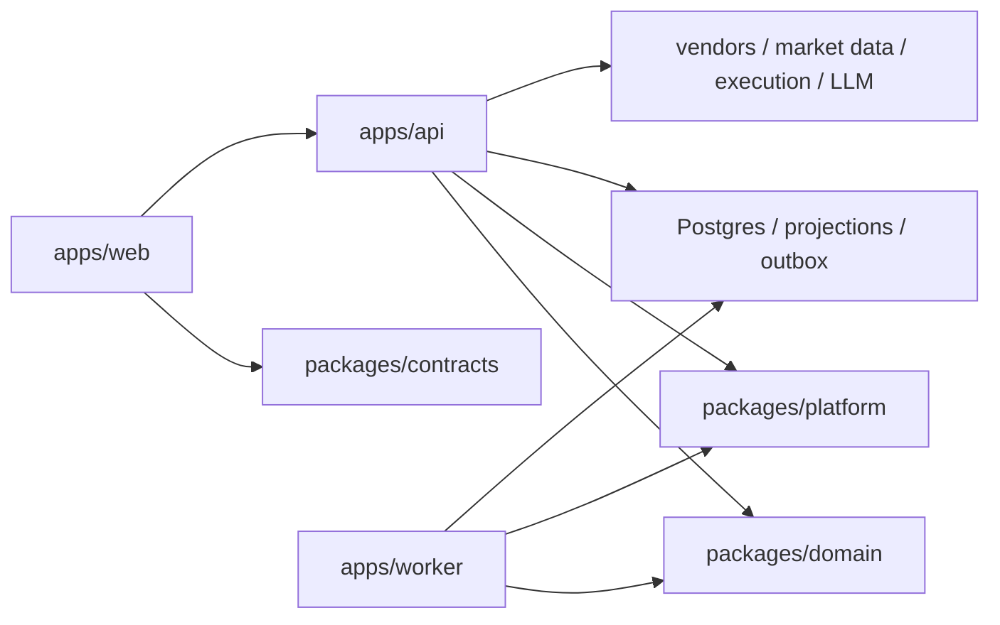

# Full-System Redesign Blueprint

Date: 2026-03-08  
Status: active design authority  
Scope: `/Users/ej/Downloads/maxidoge-clones/frontend` as the canonical implementation workspace, plus the sibling `backend` tree as an observed input only

## 1. Executive Decision

The system should not evolve as two long-lived mirrored full-stack apps.

The correct redesign is:

1. one canonical `web` runtime for UI, SSR, client state, and interaction shells
2. one `api` runtime for auth, durable mutations, projections, and vendor/server orchestration
3. one `worker` runtime for slow, retryable, and outbox-driven workflows
4. one shared `contracts` layer for transport-safe DTOs and envelopes
5. one shared `domain/platform` layer for reusable use-cases, repositories, adapters, and security/session primitives

This document is the top-level design authority that consolidates:

1. `web-api-worker-phased-migration-map-2026-03-07.md`
2. `frontend-internal-web-server-split-design-2026-03-07.md`
3. `full-stack-redesign-validation-2026-03-07.md`
4. `phase-1-contract-catalog-2026-03-07.md`
5. the domain-specific boundary inventory set under this folder

Those documents remain supporting evidence and detailed execution references.

## 2. Why This Design Is Correct

The current codebase already proves four things:

1. `frontend` is still the only real implementation authority
2. the sibling `backend` is currently a mirrored app, not the backend target we want
3. `src/lib/api/**` is already the best anti-corruption seam between browser code and server authority
4. the main risk is not missing features; it is boundary drift, duplicated runtime responsibility, and migration order mistakes

So the redesign must optimize for:

1. one canonical implementation path
2. strict runtime ownership
3. phased extraction with reversible checkpoints
4. domain-by-domain migration instead of folder-by-folder copying

## 3. Non-Negotiable Architecture Rules

These are the rules the redesign must enforce.

## 3.1 Runtime authority

`web` may:

1. render routes and layouts
2. hold browser/session-local state
3. do optimistic staging
4. orchestrate UI-first shells such as `terminal`, `arena`, and `passport`

`web` may not:

1. issue sessions
2. own DB truth
3. own durable mutation authority
4. import server implementation modules
5. treat cached browser persistence as source of truth

`api` owns:

1. auth and session authority
2. validation and rate-limit boundaries
3. durable mutations
4. server-side read projections
5. vendor/provider orchestration
6. durable activity and notification writes

`worker` owns:

1. learning job orchestration
2. dataset builds
3. report generation
4. outbox consumers
5. slow or retryable background flows

## 3.2 Boundary rule

Every feature must obey this chain:

`route/component/store -> lib/api wrapper -> route handler -> lib/server or domain service -> DB/provider`

These shapes are explicitly disallowed:

1. `component/store -> fetch('/api/...')` when a wrapper exists
2. `src/lib/api/** -> $lib/server/**`
3. `browser store -> durable domain authority`
4. `route page -> large business orchestration tree`

## 3.3 Contract rule

Everything that crosses the browser/server seam must be transport-safe.

That means:

1. no DB row types in browser-facing modules
2. no vendor SDK types in browser-facing modules
3. no session cookie implementation details in contract files
4. one canonical success/error envelope
5. one canonical set of domain DTOs

## 4. Final Target Topology



Target repository structure:

```text
apps/
  web/
  api/
  worker/
packages/
  contracts/
  domain/
    auth/
    profile/
    trading/
    social/
    portfolio/
    terminal/
    arena/
    passport/
    shell/
  platform/
    db/
    session/
    vendors/
    security/
    observability/
```

## 5. Domain Ownership Model

The redesign is only safe if each domain gets one clear authority owner.

| Domain | Web owns | API owns | Worker owns | Notes |
| --- | --- | --- | --- | --- |
| Auth / Session | login UI, wallet connect UI, auth hydration state | session issuance, cookie authority, wallet verification, guards | none | root dependency for every authenticated surface |
| Profile | display state, optimistic edit staging | profile projection, badge/tier/stats truth | none | projection is server-owned, not store-owned |
| Preferences / UI State | local restore cache, shell toggles | durable preferences and UI-state persistence | none | must stay distinct from profile |
| Quick Trades | panel UI, optimistic trade row staging | trade open/close/prices mutation truth | none | separate from social trading |
| Signals / Copy Trades / Community | feed UI, editor drafts, optimistic reaction state | signal records, copy-trade publication, community mutation truth | none | social mutation authority is API-only |
| Positions / Portfolio / Venue Execution | display and compare views | unified positions read model, venue auth/submit/status | none | split read model from venue execution |
| Terminal | route shell, intel view state, chart interaction runtime | scan, chat, intel, market snapshot/ticker APIs | none | terminal is an interaction shell, not a durable owner |
| Arena / Predictions / Tournaments | local phase runtime, replay, chart bridge, battle presentation | persisted matches, war-room generation, tournament lifecycle, progression writes | none | local-first UI, real server persistence |
| Passport / Learning | dashboard composition, tab/view state | passport projection and job control endpoints | learning pipelines, report generation, async jobs | this domain ultimately wants a worker |
| Shell / Notifications / Activity | layout shell, toast state, bootstrap UI | durable notifications, activity writes, boot hydration | async fan-out if needed later | cross-domain integration boundary |

## 6. Required Internal Split Before Physical Extraction

Inside the current `frontend` workspace, code must first behave as if it were already split.

Logical zones:

1. `web zone`
   - `src/routes/**/*.svelte`
   - `src/components/**`
   - `src/lib/stores/**`
   - `src/lib/api/**`
   - browser-facing runtime folders such as `src/lib/terminal/**`, `src/lib/chart/**`, `src/lib/arena/**`
2. `server zone`
   - `src/routes/api/**/+server.ts`
   - `src/lib/server/**`
3. `contract zone`
   - `src/lib/contracts/**`

Exit conditions for this internal split:

1. browser-facing files do not import `$lib/server/**`
2. direct `/api` fetch is removed from components/stores where a wrapper exists
3. contract types stop living inside server implementation files
4. route pages stop holding durable business authority

## 7. Phased Migration Program

## Phase 0. Boundary Freeze

Goal:

Stop the monolith from getting more entangled.

Work:

1. eliminate browser imports of `$lib/server/**`
2. route direct fetches through wrapper modules
3. split hybrid stores that mix durable records and ephemeral UI state
4. keep route handlers thin enough for extraction

Gate:

1. grep shows no browser-side `$lib/server` import
2. wrapper coverage is complete for active domains
3. new work follows the seam mechanically

## Phase 1. Contract Spine

Goal:

Create the transport-safe contract layer first.

Work:

1. canonical HTTP envelope
2. auth/session contracts
3. profile/preferences/ui-state contracts
4. quick-trades and social-trading contracts
5. positions/portfolio/venue-execution contracts
6. terminal scan/chat/intel/market contracts
7. arena and passport control contracts

Gate:

1. wrappers stop owning private DTOs
2. wrappers stop importing server implementation types
3. route handlers can normalize legacy envelopes into the canonical result shape

## Phase 2. Identity and Settings Extraction

Goal:

Move the root dependencies first.

Work:

1. auth/session domain modules
2. profile projection modules
3. preferences/ui-state persistence modules
4. durable notification read/write normalization if coupled to auth hydration

Gate:

1. cookie authority is isolated
2. profile/preferences do not depend on terminal/arena/passport code
3. web consumes only contracts and API wrappers

## Phase 3. Trading and Social Extraction

Goal:

Separate trade mutation authority from social mutation authority.

Work:

1. quick-trade mutation service extraction
2. tracked-signal and convert flow extraction
3. copy-trade publish/run extraction
4. community post/reaction extraction

Gate:

1. `quick_trades`, `tracked_signals`, and community records are no longer shaped in wrappers/stores
2. social trading can evolve without touching venue execution code

## Phase 4. Positions, Portfolio, and Terminal Extraction

Goal:

Move read-heavy and interaction-heavy server dependencies without moving the terminal shell itself.

Work:

1. unified positions read model
2. GMX and Polymarket execution/control endpoints
3. holdings/portfolio projection
4. terminal scan, chat, intel, and market provider orchestration

Gate:

1. terminal remains a web shell only
2. positions/portfolio contracts are stable
3. vendor/provider access is fully API-owned

## Phase 5. Arena and Progression Extraction

Goal:

Split local battle runtime from persisted match authority.

Work:

1. match lifecycle services
2. war-room generation
3. tournament orchestration
4. progression side effects
5. arena server adapters behind thin handlers

Gate:

1. local arena session remains in `web`
2. persisted lifecycle is API-owned
3. no arena page owns durable match truth

## Phase 6. Worker Extraction

Goal:

Move slow and retryable work out of synchronous request handlers.

Work:

1. passport learning pipelines
2. report generation
3. dataset build jobs
4. outbox/event-driven fan-out

Gate:

1. no slow workflow requires a browser request to stay open
2. worker contracts are stable and idempotent

## Phase 7. Physical App Split

Goal:

Only after phases 0-6 are stable, carve the monolith into real runtimes.

Work:

1. materialize `apps/web`
2. materialize `apps/api`
3. materialize `apps/worker`
4. move shared layers into `packages/contracts`, `packages/domain`, `packages/platform`
5. remove the mirrored sibling `backend` app shape

Gate:

1. each runtime has one responsibility
2. moving files is now mechanical, not interpretive
3. no duplicated full-stack app remains

## 8. Physical Move Map

This is the final move intent after the internal split is proven.

| Current area | Final home |
| --- | --- |
| `src/routes/**/*.svelte` | `apps/web/src/routes/**` |
| `src/components/**` | `apps/web/src/components/**` |
| `src/lib/api/**` | `apps/web/src/lib/api/**` |
| browser stores and interaction runtimes | `apps/web/src/lib/**` |
| `src/routes/api/**/+server.ts` | `apps/api/src/routes/**` or equivalent API entry layer |
| `src/lib/server/**` | `packages/domain/**` and `packages/platform/**`, with thin adapters in `apps/api` |
| `src/lib/contracts/**` | `packages/contracts/**` |
| learning/report/job flows | `apps/worker/**` with shared use-cases in `packages/domain/**` |

## 9. Validation Strategy

We will know the redesign is correct when these checks stay green while moving through phases.

## 9.1 Static boundary validation

1. no browser-side `$lib/server/**` imports
2. no new direct `/api` fetch in stores/components where wrappers exist
3. no contract file imports server-only modules

## 9.2 Structural validation

1. route handlers become thinner over time
2. wrapper-local DTO count goes down
3. hybrid stores are split into durable projection vs ephemeral UI state

## 9.3 Runtime validation

1. `npm run docs:check`
2. `npm run check`
3. `npm run build`
4. contract adoption checks as they are added

## 9.4 Migration validation

For each domain cutover:

1. request/response contracts are identical before and after extraction
2. auth/session behavior is unchanged
3. optimistic UI still reconciles against backend-owned truth
4. failure envelopes are normalized, not widened

## 10. Anti-Goals

Do not do any of these:

1. copy `frontend` into `backend` again
2. split by folder names before runtime ownership is clear
3. move `terminal`, `arena`, or `passport` wholesale into backend
4. let worker logic remain trapped behind synchronous route handlers forever
5. treat browser persistence as a durable source of truth

## 11. Immediate Execution Order

This blueprint implies the next concrete execution queue:

1. keep shrinking boundary leaks inside the canonical `frontend` app
2. finish contract extraction until every active domain has contract-owned DTOs
3. harden root dependencies first: auth/session, profile, preferences/ui-state
4. then cut trading/social, positions/portfolio, terminal/market, arena/progression, passport/worker in that order
5. only then perform the physical `web / api / worker` split

## 12. Supporting Design References

Use these as detailed drill-down documents, not replacement top-level plans:

1. `web-api-worker-phased-migration-map-2026-03-07.md`
2. `frontend-internal-web-server-split-design-2026-03-07.md`
3. `full-stack-redesign-validation-2026-03-07.md`
4. `phase-1-contract-catalog-2026-03-07.md`
5. `internal-extraction-folder-map-2026-03-07.md`
6. all `*-boundary-inventory-2026-03-07.md` documents in this folder

## 13. Final Verdict

The redesign is:

1. validated against the current codebase
2. compatible with the already-established wrapper seam
3. safer than direct repo/app splitting
4. capable of absorbing the current frontend refactor work instead of discarding it

This is the design to follow unless a later validation disproves one of the runtime ownership assumptions above.
