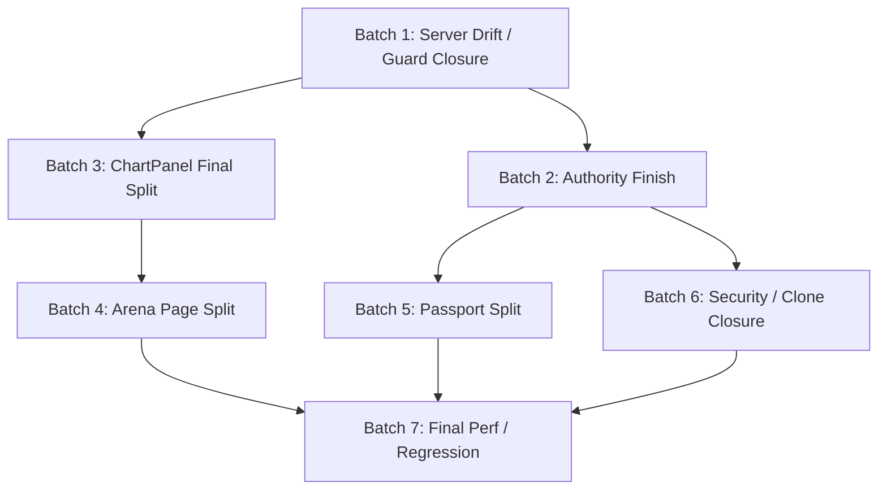

# Remaining Structure Refactor Batches

Date: 2026-03-07  
Status: active  
Scope: `/Users/ej/Downloads/maxidoge-clones/frontend`  
Purpose: define the remaining 5-7 execution batches needed to move from "stable and usable" to "structurally clean".

## Snapshot

As of 2026-03-07:

- `npm run check`: PASS (`0 errors / 0 warnings`)
- `npm run build`: PASS
- Major hotspot file sizes:
  - [`src/components/arena/ChartPanel.svelte`](../../../src/components/arena/ChartPanel.svelte): 3192 lines
  - [`src/routes/arena/+page.svelte`](../../../src/routes/arena/+page.svelte): 3398 lines
  - [`src/routes/passport/+page.svelte`](../../../src/routes/passport/+page.svelte): 2693 lines
  - [`src/components/terminal/IntelPanel.svelte`](../../../src/components/terminal/IntelPanel.svelte): 891 lines
  - [`src/routes/terminal/+page.svelte`](../../../src/routes/terminal/+page.svelte): 1139 lines
- Heavy server outputs still include:
  - `/terminal`: 140.27 kB
  - `/arena`: 114.71 kB
  - `/api/terminal/intel-policy`: 53.64 kB
  - `/api/arena/analyze`: 67.49 kB

## Current Position

The project is no longer in "unsafe prototype" territory.

What is already largely true:

1. the app builds and checks cleanly
2. terminal has had a meaningful first split
3. price/state authority direction has improved
4. quick trade / tracked signal / copy trade flows are much safer than before
5. chart decomposition has started and is real, not theoretical

What is still not true:

1. the full-stack boundary is not fully enforced by responsibility
2. the last heavy files still own too many concerns
3. server authority is improved, but not yet "final-form clean"
4. legacy clone cleanup is documented, not finished
5. security hardening is present, but not yet closed out

## Progress Estimate

Working estimate:

- feature and operational stability: `70-75%`
- structural and architectural completion: `60%`

Meaning:

- the easy instability work is mostly behind us
- the remaining work is concentrated into a few high-mass files and boundary layers

## Execution Rules

1. `frontend/` remains the only implementation target.
2. `backend/` remains reference-only.
3. New batches must avoid overlapping edits on already-active UI slices unless they are explicitly coordinated.
4. Server-boundary cleanup lands before the last major UI decomposition batches.
5. Each batch must end in a state that passes `npm run check` and `npm run build`.

## Remaining Batches

### Batch 1. Server Drift And Guard Closure

Goal:
- close the most dangerous remaining same-path drift and standardize request handling

Primary files:
- [`src/lib/server/requestGuards.ts`](../../../src/lib/server/requestGuards.ts)
- [`src/routes/api/copy-trades/publish/+server.ts`](../../../src/routes/api/copy-trades/publish/+server.ts)
- [`src/routes/api/quick-trades/open/+server.ts`](../../../src/routes/api/quick-trades/open/+server.ts)
- [`src/routes/api/quick-trades/[id]/close/+server.ts`](../../../src/routes/api/quick-trades/[id]/close/+server.ts)
- [`src/routes/api/signals/track/+server.ts`](../../../src/routes/api/signals/track/+server.ts)
- [`src/routes/api/profile/+server.ts`](../../../src/routes/api/profile/+server.ts)
- [`src/lib/server/db.ts`](../../../src/lib/server/db.ts)

Design:
- all high-risk mutation endpoints use one body parsing pattern
- all high-risk mutation endpoints use one abuse-guard pattern
- `frontend` stays the base; `backend` delta is merged only if it is strictly higher-signal
- idempotency must be stable by mutation identity, not by fuzzy time window alone

DoD:
- no critical mutation handler still relies on ad hoc `request.json()` parsing
- request size and malformed-body handling are standardized
- quick trade / signal / copy trade mutations reconcile deterministically

Why first:
- it reduces real bug risk more than another UI split would

### Batch 2. Authority Finish For Profile And Agent Domains

Goal:
- finish the "server-authoritative" move for profile and agent-facing progression surfaces

Primary files:
- [`src/lib/stores/userProfileStore.ts`](../../../src/lib/stores/userProfileStore.ts)
- [`src/lib/stores/agentData.ts`](../../../src/lib/stores/agentData.ts)
- [`src/routes/passport/+page.svelte`](../../../src/routes/passport/+page.svelte)
- [`src/lib/server/profileProjection.ts`](../../../src/lib/server/profileProjection.ts)
- related profile/passport APIs

Design:
- store role becomes projection cache + optimistic UI only
- client-derived profile metrics are either downgraded to presentation-only or moved behind explicit server projection
- agent stats fan-out sync is replaced with pull-based or narrower mutation-based sync

DoD:
- profile tier, badges, tracked counts, and agent stats are no longer effectively owned by the browser
- localStorage cannot become long-term truth after refresh/hydration
- passport page consumes cleaner domain slices rather than mixed local truth

Why second:
- passport decomposition will be cleaner after authority is settled

### Batch 3. ChartPanel Final Runtime Split

Goal:
- turn `ChartPanel.svelte` from a control tower into a coordinator

Primary files:
- [`src/components/arena/ChartPanel.svelte`](../../../src/components/arena/ChartPanel.svelte)
- `src/components/arena/chart/chartBootstrap.ts`
- `src/components/arena/chart/chartDataRuntime.ts`
- `src/components/arena/chart/chartRuntimeBindings.ts`
- `src/components/arena/chart/chartTradingViewRuntime.ts`
- `src/components/arena/chart/chartOverlayRenderer.ts`
- `src/components/arena/chart/chartPositionInteraction.ts`
- `src/components/arena/chart/chartPatternEngine.ts`

Target architecture:
- bootstrap/runtime creation
- market data lifecycle
- indicator state + pattern scheduling
- drawing + overlay rendering
- trade planner interactions
- TradingView fallback runtime
- view component only coordinates props, DOM refs, and events

Sub-slices inside the batch:
1. finalize runtime/bootstrap ownership
2. isolate drawing/overlay contract
3. isolate trade planning interaction contract
4. isolate pattern scan scheduler and result binding
5. finish TradingView runtime boundary

DoD:
- `ChartPanel.svelte` line count drops again materially
- the component no longer owns direct runtime teardown details for multiple subsystems
- chart regressions can be tested by module boundary, not only by page-wide behavior

Why third:
- this is the heaviest remaining component and blocks clean `arena` page cleanup

### Batch 4. Arena Page Controller Split

Goal:
- break `arena/+page.svelte` into orchestration layers

Primary files:
- [`src/routes/arena/+page.svelte`](../../../src/routes/arena/+page.svelte)
- [`src/components/arena/arenaState.ts`](../../../src/components/arena/arenaState.ts)
- `src/lib/engine/arena*`
- new route-local controller modules if needed

Target architecture:
- match lifecycle controller
- battle presentation controller
- replay/reward controller
- chart integration adapter
- phase transition rules

Likely extraction targets:
- server match lifecycle and sync
- replay orchestration
- battle turn scheduling / resolver wiring
- chart position and annotation bridge
- feed/live-event orchestration

DoD:
- route file becomes a shell/controller composition layer instead of a monolith
- phase transitions are easier to trace and test
- battle/replay/chart coordination no longer competes inside one file

Why fourth:
- `arena/+page` depends on a stable chart boundary

### Batch 5. Passport Page Split

Goal:
- decompose `passport/+page.svelte` into clear vertical slices after authority is settled

Primary files:
- [`src/routes/passport/+page.svelte`](../../../src/routes/passport/+page.svelte)
- `src/components/passport/*`
- passport helpers / view models

Target architecture:
- profile summary section
- wallet/holdings section
- positions section
- learning pipeline section
- agent performance / match history section
- tab shell and UI-state persistence adapter

Likely extraction targets:
- holdings sync runtime
- learning panel runtime
- focus insight derivation
- tab shell and CTA strip

DoD:
- passport route file becomes a composition shell
- holdings and learning pipelines are isolated from presentation markup
- profile screen can evolve without dragging positions/learning logic with it

Why fifth:
- authority fixes must land first, or the split just preserves the wrong data ownership

### Batch 6. Security Hardening And Legacy Clone Closure

Goal:
- finish the non-UI structural cleanup

Primary files:
- [`src/hooks.server.ts`](../../../src/hooks.server.ts)
- security-sensitive APIs in `src/routes/api`
- clone/archive docs and dead reference paths

Scope:
- review CSP and external embed policy closure
- ensure high-cost endpoints have abuse guards
- archive or explicitly freeze backend-only dead leftovers
- close the remaining "which folder is real?" ambiguity in docs/process

DoD:
- CSP and external frame/connect policy match actual runtime needs
- no expensive public-ish endpoint is left unguarded by accident
- `backend/` is operationally dead as an implementation target

Why sixth:
- this is best done after the main server and page refactors settle

### Batch 7. Final Performance And Regression Pass

Goal:
- verify that the structural cleanup translated into lower complexity and safer runtime behavior

Scope:
- bundle/build surface review
- route/server output comparison
- hotspot re-measurement
- dead code and obsolete compatibility path cleanup
- docs promotion and plan closure

DoD:
- hotspot files are materially smaller or cleaner in responsibility
- no temporary adapter introduced in earlier batches is left dangling
- active plan docs can move toward completed/archive

Why last:
- performance and cleanup should measure the final shape, not an intermediate one

## Recommended Batch Count

Realistically:

- minimum credible path: `5` batches
- safer path with lower merge risk: `7` batches

Recommended split for current repo state:

1. Server Drift And Guard Closure
2. Authority Finish For Profile And Agent Domains
3. ChartPanel Final Runtime Split
4. Arena Page Controller Split
5. Passport Page Split
6. Security Hardening And Legacy Clone Closure
7. Final Performance And Regression Pass

## Batch Dependencies

## What Not To Do

Do not:

1. continue broad UI polish before Batch 1 lands
2. split `passport/+page.svelte` before authority cleanup
3. split `arena/+page.svelte` before `ChartPanel` runtime boundaries are stable
4. re-open `backend/` as a working surface
5. treat zero warnings as proof that architecture is complete

## Immediate Next Move

The next new engineering slice should be:

1. [`src/lib/server/requestGuards.ts`](../../../src/lib/server/requestGuards.ts)
2. [`src/routes/api/copy-trades/publish/+server.ts`](../../../src/routes/api/copy-trades/publish/+server.ts)
3. [`src/routes/api/quick-trades/open/+server.ts`](../../../src/routes/api/quick-trades/open/+server.ts)
4. [`src/routes/api/quick-trades/[id]/close/+server.ts`](../../../src/routes/api/quick-trades/[id]/close/+server.ts)

Only after that should another major UI-heavy split start.
