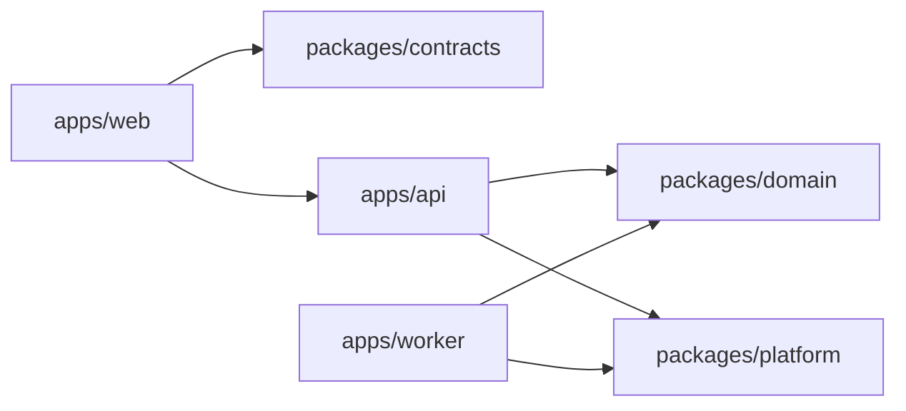

# Web / API / Worker Phased Migration Map

Date: 2026-03-07  
Status: active design authority  
Scope: `/Users/ej/Downloads/maxidoge-clones/frontend`

## 1. Decision Summary

The validated migration order is:

1. freeze the internal `web zone / server zone / contract zone` boundary inside the current `frontend` app
2. extract shared contracts and neutral domain/platform seams
3. cut over domain groups into an API-only backend in dependency order
4. extract long-running and retryable workflows into a worker runtime last

This plan is the consolidation of the active inventory set:

1. `auth-session-internal-boundary-inventory-2026-03-07.md`
2. `profile-preferences-internal-boundary-inventory-2026-03-07.md`
3. `quick-trades-internal-boundary-inventory-2026-03-07.md`
4. `signals-copy-trades-community-internal-boundary-inventory-2026-03-07.md`
5. `terminal-market-intel-interaction-boundary-inventory-2026-03-07.md`
6. `positions-portfolio-execution-boundary-inventory-2026-03-07.md`
7. `passport-learning-jobs-boundary-inventory-2026-03-07.md`
8. `arena-predictions-match-orchestration-boundary-inventory-2026-03-07.md`
9. `global-shell-notifications-activity-boundary-inventory-2026-03-07.md`

## 2. Validated Design Constraints

The inventory pass gives us these hard constraints.

## 2.1 Auth is the root dependency

`auth/session` is not an isolated feature.

It is the server identity boundary used by:

1. profile
2. preferences
3. quick trades
4. signals and copy trades
5. positions
6. passport
7. notifications
8. arena server routes

Implication:

No physical extraction starts before auth/session contract and cookie ownership are frozen.

## 2.2 Profile is a server projection, not a client store

`profile`, `passport projection`, `preferences`, and `ui-state` are adjacent but different authorities:

1. `users` owns account identity
2. `user_profiles` plus `profileProjection.ts` owns profile projection
3. `user_preferences` owns durable user preferences
4. `user_ui_state` owns persisted view state only

Implication:

The browser may cache and stage, but it must stop behaving like a secondary profile authority.

## 2.3 Trading is not one domain

The inventory showed four distinct authorities that only look unified in the UI:

1. `quick_trades`
2. `tracked_signals` and community/share flows
3. venue execution flows for Polymarket and GMX
4. read-side portfolio holdings

Implication:

Extraction must separate:

1. trade mutation authority
2. social-trading mutation authority
3. venue execution authority
4. portfolio projection authority

## 2.4 Terminal is an interaction shell, not a durable domain owner

`terminal` fans out into:

1. scan
2. intel feeds
3. chat
4. market snapshot and ticker
5. quick-trade actions
6. tracked-signal actions
7. community share
8. positions reads

Implication:

`terminal` stays in `web`, while its durable server authorities move out behind narrower API surfaces.

## 2.5 Arena is local-first, but persistence is real

The arena inventory validated two different truths:

1. local phase, replay, chart, and presentation runtime belongs in the web app
2. persisted match lifecycle, war-room generation, tournament registration, and resolution side effects belong in the backend

Implication:

We do not move arena wholesale. We split local session runtime from persisted workflow authority.

## 2.6 Passport learning already wants a worker

`passport` is partly a read dashboard and partly a control plane for:

1. dataset builds
2. eval runs
3. train-job queueing
4. report generation
5. outbox-driven learning events

Implication:

This domain should end in `worker`, not stay behind synchronous web request handlers forever.

## 2.7 Global shell is a cross-domain integration point

The shell inventory validated that:

1. `+layout.svelte` mixes shell composition and global market runtime
2. `Header.svelte` bootstraps auth and domain hydration
3. `notificationStore.ts` mixes durable notifications, local toasts, P0 state, and demo seeding
4. `activity_events` writes are scattered across route handlers

Implication:

Shell extraction is not just a UI cleanup task. It is a cross-domain bootstrap and activity-platform boundary.

## 3. Final Target Topology

Runtime intent:

1. `apps/web`
   - routes, layouts, browser stores, view runtimes, optimistic staging
2. `apps/api`
   - auth, validation, HTTP orchestration, durable mutations, projections, provider fan-in
3. `apps/worker`
   - outbox consumers, learning jobs, report generation, retryable or slow workflows
4. `packages/contracts`
   - DTOs, schemas, enums, error envelopes
5. `packages/domain`
   - policies and use-cases that should not live in route handlers or client stores
6. `packages/platform`
   - DB, repositories, sessions, provider adapters, rate-limit and security primitives

## 4. Phase Map

## Phase 0. Boundary Freeze Inside `frontend`

Goal:

Make the current app obey one extraction rule:

`web -> lib/api -> routes/api -> lib/server`

Required work:

1. remove `$lib/server` type imports from `src/lib/api/**`
2. remove direct `/api/...` fetch from stores/components when a wrapper exists
3. stop route pages from owning durable business authority
4. split hybrid browser stores where durable records and local UI state are mixed
5. split shell-local toasts from durable notifications

Known blockers already validated:

1. `positionsApi.ts` imports a server type
2. `warRoomStore.ts` performs direct fetch
3. `notificationStore.ts` is hybrid durable-plus-ephemeral state
4. `terminalApi.ts` imports scan DTO types from a server implementation file

Exit gate:

1. no browser-facing file imports `$lib/server/**`
2. no new direct `/api` fetch remains in browser state layers where a wrapper exists
3. route handlers are thin enough that domain logic can be named separately

## Phase 1. Contract Spine Extraction

Goal:

Create a stable contract layer before moving runtimes.

Required work:

1. define a shared success envelope
2. define a shared error envelope
3. extract auth/session DTOs
4. extract profile/preferences/ui-state DTOs
5. extract quick-trade and social-trading DTOs
6. extract position, portfolio, and venue-execution DTOs
7. extract terminal scan/chat/intel DTOs
8. extract arena match/tournament DTOs

This phase also moves neutral policies out of browser stores when required.

Examples:

1. progression rules should not live under `src/lib/stores`
2. execution typed-data shapes should not live under server implementation modules

Exit gate:

1. all major browser wrappers depend only on transport-safe contracts
2. contract versioning is explicit enough to support an external API service

## Phase 2. Core Identity and Settings API Cutover

Move first because everything else depends on it.

Domains:

1. auth/session
2. profile
3. preferences
4. ui-state
5. notifications
6. activity read/write service entry

Why this group first:

1. it is the root authenticated surface
2. profile and preferences already have relatively narrow route sets
3. notifications and activity are cross-surface concerns that should stop being scattered

Expected runtime split:

1. `web`
   - wallet modal UX, settings forms, profile cards, local toasts
2. `api`
   - cookie/session issuance, profile projection, preference persistence, notification CRUD, centralized activity writer

Exit gate:

1. authenticated session bootstrap works against `apps/api`
2. profile and settings screens no longer rely on in-app server modules
3. activity writes are centralized behind one API-side service

## Phase 3. Trading and Social Core Cutover

Domains:

1. quick trades
2. tracked signals
3. community posts and reactions
4. copy-trade publish flows
5. portfolio holdings projection
6. Polymarket execution
7. GMX execution

Why this group second:

1. these domains already share trade-side effects
2. profile projection and passport read models depend on them
3. they are mutation-heavy and benefit early from stable backend authority

Required restructuring inside the phase:

1. separate quick-trade authority from social-trading authority
2. separate unified positions read model from venue execution flows
3. keep holdings as a portfolio projection, not another execution subtype
4. stop browser-driven reconciliation from acting like mutation truth

Exit gate:

1. all trade and social mutations are backend-owned
2. browser stores act as cache and optimistic view only
3. venue execution flows have transport-safe contract definitions

## Phase 4. Market and Terminal API Cutover

Domains:

1. market snapshot and ticker
2. terminal scan
3. intel feeds
4. chat
5. intel-policy and shadow routes
6. alert and market fan-in utilities

Why after trading:

1. terminal is mostly an interaction shell that issues into already-extracted domains
2. terminal becomes easier to narrow once trade, signal, and community mutations are already externalized

Required restructuring inside the phase:

1. split `terminalApi.ts` into narrower transport surfaces if needed
2. move market ticker composition to a server-owned snapshot contract
3. keep local terminal session runtimes in `web`
4. move provider fan-in and LLM orchestration fully into `api`

Exit gate:

1. terminal route remains a web shell only
2. chat, scan, and intel all resolve through external API contracts
3. browser no longer composes market truth from multiple secret-bearing endpoints

## Phase 5. Arena and Progression Backend Cutover

Domains:

1. arena persisted match lifecycle
2. war-room generation
3. tournament lifecycle
4. match resolution
5. progression side effects

Why late:

1. arena is the most hybrid local-plus-server system
2. it has the highest risk of breaking gameplay feel if extracted too early
3. passport and progression already depend on its outputs

Required restructuring inside the phase:

1. keep `gameState` and local battle/replay runtimes in `web`
2. move persisted match lifecycle and tournaments into `api`
3. separate progression updates from arena route ownership
4. make resolve flows idempotent and backend-owned

Exit gate:

1. local arena session can still run smoothly in the browser
2. persisted match lifecycle and progression settlement are backend authority
3. tournament state is no longer hidden behind the browser arena API surface

## Phase 6. Worker Cutover

Domains:

1. passport learning pipeline
2. report generation
3. train-job queueing
4. dataset builds
5. outbox consumers
6. any slow notification/activity fan-out that should become async

Why last:

1. worker extraction depends on stable API-side mutation and projection boundaries
2. long-running jobs should not be extracted before their input contracts stop moving

Exit gate:

1. learning routes submit work rather than execute heavy jobs inline
2. worker reads stable contracts and platform primitives
3. slow jobs are retryable without involving the web app

## 5. Domain-to-Runtime Ownership Matrix

| Domain | Web | API | Worker | Extraction phase |
| --- | --- | --- | --- | --- |
| Auth / Session | login and wallet UX | session issuance, nonce, verification, guards | no | Phase 2 |
| Profile / Preferences / UI state | forms, local cache, tabs | projection, persistence, validation | optional async projection refresh later | Phase 2 |
| Notifications / Activity | tray UI, toast UI | durable notifications, centralized activity writes | optional async fan-out later | Phase 2 |
| Quick Trades | forms and optimistic UI | durable trade writes and reconcile | passport outbox side effects | Phase 3 |
| Signals / Copy / Community | feed UI, share UI, reactions UI | durable social-trading writes | optional async fan-out | Phase 3 |
| Positions / Portfolio / Execution | venue panels and dashboards | unified read model, holdings projection, execution APIs | no | Phase 3 |
| Terminal / Market / Intel | shell and local runtimes | scan, chat, intel, market aggregation | optional async heavy jobs | Phase 4 |
| Arena / Predictions / Tournaments | local phase, replay, chart, presentation | persisted lifecycle, tournaments, progression side effects | settlement jobs if needed later | Phase 5 |
| Passport Learning | control UI and status | submission and status APIs | dataset, eval, train, reports | Phase 6 |

## 6. What Is Explicitly Rejected

Do not do these:

1. do not cut files into the current sibling `backend` tree as-is
2. do not extract by folder name alone
3. do not move `terminal` before its adjacent mutation domains
4. do not move `arena` before trading, profile, and progression boundaries are stable
5. do not keep learning and report generation as synchronous page-side control forever
6. do not keep `notificationStore` as one mixed durable-plus-ephemeral authority

## 7. Validation Rules For Every Phase

Every phase must prove:

1. `npm run docs:check` passes
2. `npm run check` passes
3. `npm run build` passes
4. browser wrappers do not import server implementation modules
5. durable authority moved to the intended runtime, while local UI/runtime state stayed in `web`

Additionally:

1. API phases must prove contract compatibility for existing web consumers
2. worker phases must prove that job submission is decoupled from synchronous request execution

## 8. Immediate Next Step

The next document should not be another broad inventory.

It should be a concrete contract-catalog slice for Phase 1:

1. define the first shared envelopes
2. list the DTOs to extract first
3. mark which existing wrapper files still leak server implementation types

Recommended first catalog order:

1. auth/session
2. profile/preferences/ui-state
3. quick-trades and social-trading
4. positions and venue execution
5. terminal scan/chat/intel
