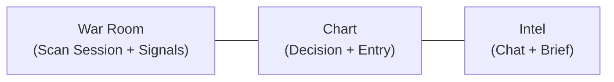
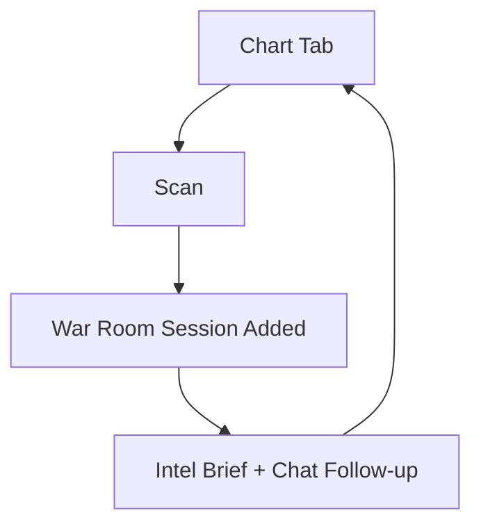

# STOCKCLAW Terminal IA Reset v1

Updated: 2026-02-22  
Source alignment:
- `/Users/ej/Downloads/STOCKCLAW_Final_Integrated_Spec_v1.md`
- `/Users/ej/Downloads/STOCKCLAW_DesignDoc_v1.md`
- `/Users/ej/Downloads/STOCKCLAW_UserJourney_v1.md`

## 1. 목적
현재 `/terminal`은 기능이 계속 추가되며 "보여줘야 할 핵심"과 "상황별 보조 정보"가 섞였습니다.  
이 문서는 Terminal 화면을 다시 정의합니다.

- 무엇을 항상 보여줄지
- 무엇을 접어둘지
- 어떤 시점에 어떤 정보가 열릴지
- War Room / Chart / Intel 역할 경계

핵심 목표는 한 줄입니다.

> 유저가 `차트에서 판단 -> 스캔 실행 -> 근거 확인 -> 진입`을 끊김 없이 수행하도록 정보 밀도를 재배치한다.

---

## 2. 진단 요약 (현재 문제)
현재 화면에서 발견된 문제는 아래 5개입니다.

1. 상단/좌측/하단에 같은 의미의 정보(페어, 시간, 상태)가 중복 노출됨
2. 스캔 결과 컨텍스트와 실시간 베이스 피드가 동시에 섞여 "지금 보고 있는 대상"이 불명확함
3. 차트 핵심(캔들/축/스케일)보다 컨트롤 요소가 더 시선을 가져감
4. 인텔 패널에 정보가 과다해 `AGENT CHAT` 입력과 스캔 해설 가독성이 떨어짐
5. 모바일에서 동작 순서가 분절되어 "누르면 어디에 결과가 쌓이는지"가 직관적이지 않음

---

## 3. 설계 원칙 (상위 문서 반영)
`STOCKCLAW_DesignDoc_v1.md`와 `STOCKCLAW_UserJourney_v1.md`를 반영한 Terminal 원칙입니다.

1. 독립 판단 우선: 방향/합의 노출은 사용자 행동 단계와 맞춰야 함
2. 한 화면 한 목표: 화면 영역별 1차 책임을 고정
3. 스캔 단위 세션화: 스캔 결과는 "사라지는 피드"가 아니라 "누적되는 세션"으로 유지
4. 차트 우선: 매매 판단은 차트가 중심이며 보조 정보가 차트를 가리면 안 됨
5. 모바일은 축소가 아니라 재배치: PC 구조를 그대로 줄이지 않고 탭/시트 중심으로 재편

---

## 4. 정보 우선순위 모델

## L0 (항상 고정, 의사결정 핵심)
- 현재 페어, 시간봉
- 현재가/변화율
- 스캔 실행 상태 (idle/scanning/done/error)
- 차트 캔들 + 가격축 + 시간축
- 진입/손절/익절 라인(존재 시)

## L1 (상황 기반, 기본 노출)
- 핵심 지표 5개: MA20/MA60/MA120/RSI14/VOL
- 최신 스캔 세션 요약 (합의, 평균 신뢰도, 타임스탬프)
- War Room의 에이전트 카드 목록

## L2 (접기 가능, 필요 시 열람)
- 추가 지표 MA7/MA25/MA99
- 상세 파생/OI/펀딩 메트릭
- 커뮤니티/이벤트/헤드라인 스트림

## L3 (별도 패널/모달)
- 과거 스캔 세션 히스토리
- 디버그/소스 메타 데이터
- 장문 해설

---

## 5. 화면 책임 재정의

## 5.1 War Room (좌측)
역할: `스캔 세션과 실행 가능한 신호 리스트`

항상 보여줌:
- 섹션 타이틀
- 현재 활성 스캔 세션 선택칩
- 토큰 필터
- 신호 카드(에이전트, 방향, 신뢰도, entry/tp/sl, 액션)

접기 기본:
- OI/Funding/Pred/Liq 상세 스트립
- 보조 CTA(중복 링크)

제거/병합:
- 헤더 내 중복 컨텍스트 칩(페어/시간 재반복)
- BASE와 토큰/시각 문자열 중복 노출

핵심 규칙:
- 스캔은 항상 "현재 pair + timeframe" 기준으로 세션 누적
- 동일 market 재스캔 시 같은 세션에 append, 다른 market은 새 세션 생성

## 5.2 Chart (중앙)
역할: `판단과 진입 실행`

항상 보여줌:
- Pair/Timeframe/Mode/Scan
- 캔들 + 볼륨 + RSI 패널
- 스케일 도구 (-, +, FIT, Y-AUTO, RESET) 하단 중앙 고정

접기 기본:
- 지표 토글 스트립(확장/축소/숨김 3상태)
- 보조 안내 문구(단축키 힌트)

강제 유지:
- 드로잉 결과는 마우스 업 이후 유지
- Long/Short RR 박스는 entry/sl/tp를 즉시 생성하고 차트에 남김

## 5.3 Intel (우측)
역할: `스캔 해설과 의사결정 보조`

항상 보여줌:
- `AGENT CHAT` 입력창
- 최신 스캔 브리프(요약 + 상위 근거 2~3개)

탭으로 분리:
- Chat (기본)
- Headlines
- Events
- Flow

제약:
- 기본 탭은 항상 Chat
- Intel 하단을 점유하는 대형 블록 금지 (입력창 가림 방지)

---

## 6. 레이아웃 청사진

## Desktop
권장 비율:
- War Room: 24~28%
- Chart: 48~56%
- Intel: 20~24%

## Tablet
- 상단 2열: War Room + Chart
- 하단 1열: Intel(Chat 우선)

## Mobile
- 하단 고정 탭: `Chart | War Room | Intel | Position`
- Scan 버튼은 Chart 상단에 고정
- Scan 완료 시 War Room 탭 배지 증가 + Intel에 요약 생성

---

## 7. 사용자 플로우 (단일 표준)

1. 유저가 Pair/Timeframe 선택
2. Chart에서 Scan 클릭
3. War Room에 세션 생성 또는 기존 세션 누적
4. War Room에서 신호 카드 선택
5. Intel에서 선택 신호 근거/반론 확인
6. Chart에서 RR 박스 드로잉으로 entry/sl/tp 생성
7. Quick Trade 실행

중요:
- 스캔 결과가 다른 시장으로 갑자기 리셋되면 안 됨
- 활성 세션은 탭 전환/새로고침 후 복원

---

## 8. 컴포넌트 계약 (리팩토링 기준)

## 8.1 상태 소스
- 글로벌:
  - `gameState.pair`
  - `gameState.timeframe`
- 스캔:
  - `scanSessions[]`
  - `activeScanSessionId`
  - `scanStatus`
- 차트:
  - `indicatorEnabled`
  - `indicatorStripState`
  - `drawings[]`
  - `scaleState`
- 인텔:
  - `latestScanBrief`
  - `chatMessages[]`

## 8.2 이벤트 계약
- Chart -> Shell: `scanrequest`
- Shell -> WarRoom: `triggerScanFromChart()`
- WarRoom -> Shell: `scancomplete`
- Shell -> Intel: `latestScan` props update
- Intel -> Shell: `sendchat`

## 8.3 영속화 계약
localStorage/API로 아래는 반드시 저장:
- 활성 스캔 세션 ID
- 스캔 세션 목록(최대 개수 제한)
- Indicator strip 상태(expanded/collapsed/hidden)
- Intel active tab/inner tab
- 패널 접힘 상태/폭(Desktop)

---

## 9. 성능/실시간 목표 (1000 동시 사용자 기준)

프론트엔드 목표:
- 스캔 실행 응답 시작 < 200ms (UI immediate feedback)
- 차트 틱 반영 지연 p95 < 250ms
- 탭 전환 TTI < 100ms

서버/데이터 목표:
- 가격 스트림 fan-out: WebSocket/SSE 분리
- 스캔 작업 큐: 사용자별 직렬, 글로벌 병렬 제한
- 30초 persist + 1초 UI sync 이원화 유지

운영 기준:
- 실시간 API 장애 시 degrade 모드 (마지막 성공 스냅샷 + 상태 배지)
- TradingView 실패 시 Agent chart 자동 폴백 명확화

---

## 10. GTM 이벤트 설계 (핵심만)
- `terminal_scan_request_chart`
- `terminal_scan_complete`
- `terminal_scan_session_switch`
- `terminal_indicator_toggle`
- `terminal_rrbox_create`
- `terminal_trade_execute`
- `terminal_mobile_tab_change`

추적 원칙:
- 이벤트명은 기능 단위로 고정
- pair/timeframe/viewport를 공통 파라미터로 포함

---

## 11. 구현 단계 제안

Phase A (IA 정리):
- War Room 헤더/행 구조 단순화
- 중복 컨텍스트 제거
- 스캔 세션 표시 규칙 고정

Phase B (차트 가시성):
- 상단 컨트롤 밀도 축소
- 하단 중앙 스케일 도구 고정
- 지표 상태바/레전드 분리 정리

Phase C (Intel 집중화):
- Chat 우선 레이아웃 고정
- 스캔 브리프 컴팩트 카드화
- 과다 텍스트 블록 접기

Phase D (모바일 재배치):
- 탭/바텀시트 기반 정보 계층 재설계
- Scan -> War Room -> Intel 연결 플로우 고정

---

## 12. 수용 기준 (Acceptance Criteria)

1. 사용자가 3초 내 현재 컨텍스트(pair/timeframe/scan 상태)를 인지할 수 있다.
2. 스캔 결과는 세션 단위로 누적되고 임의 리셋되지 않는다.
3. 차트 캔들이 화면 시선 중심이며 컨트롤은 보조 역할을 유지한다.
4. `AGENT CHAT` 입력창은 항상 가려지지 않는다.
5. 모바일에서 스캔 후 결과 확인 경로가 2탭 이내로 완료된다.
6. 동일 데이터가 2개 이상 영역에 중복 텍스트로 반복되지 않는다.

